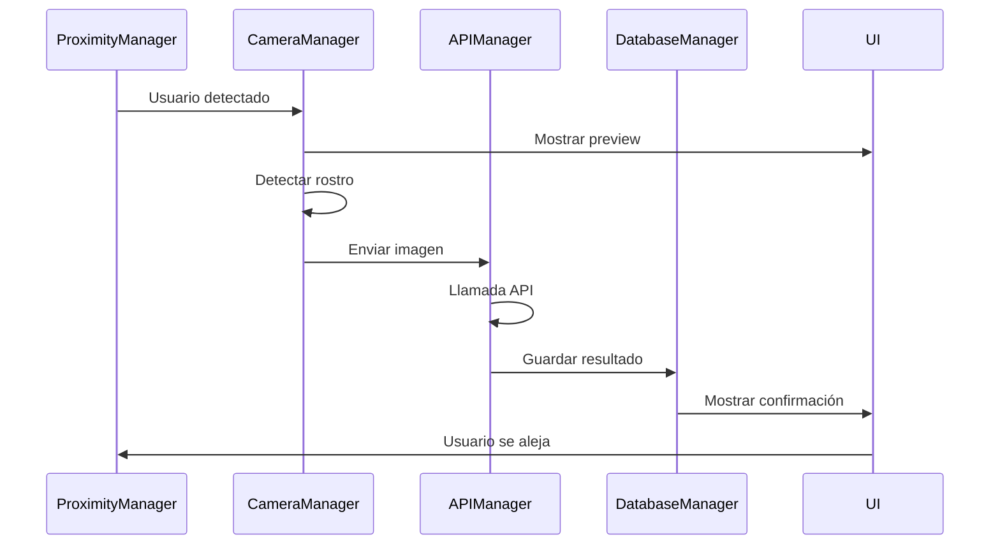
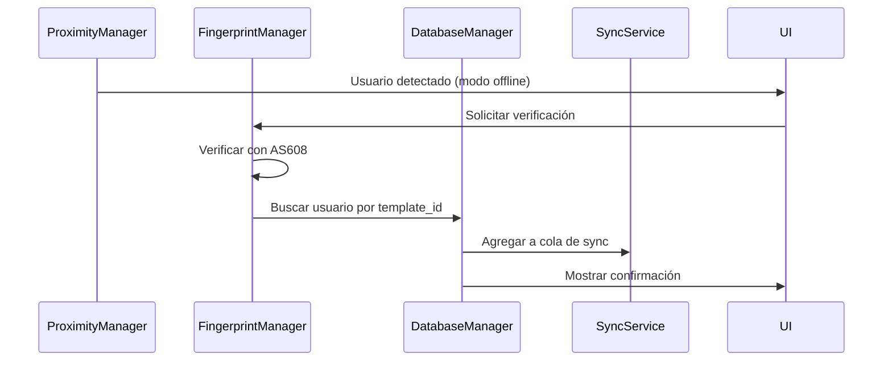
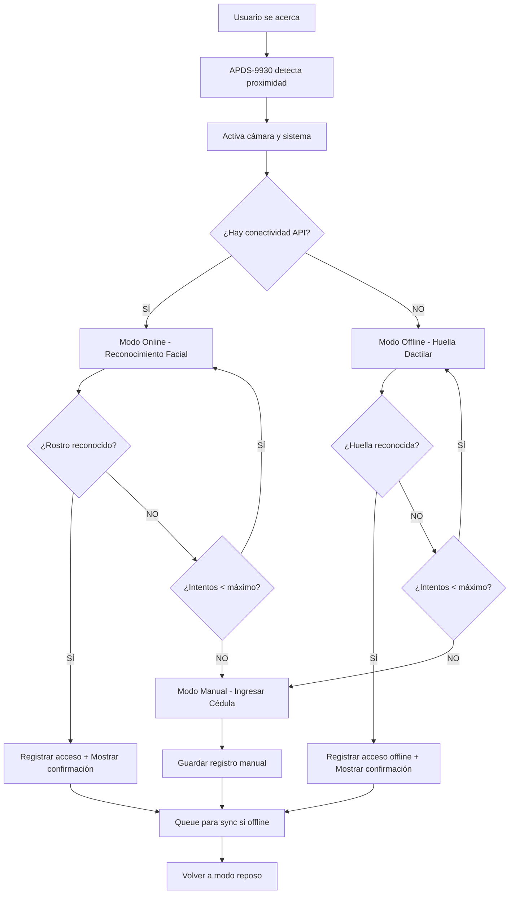
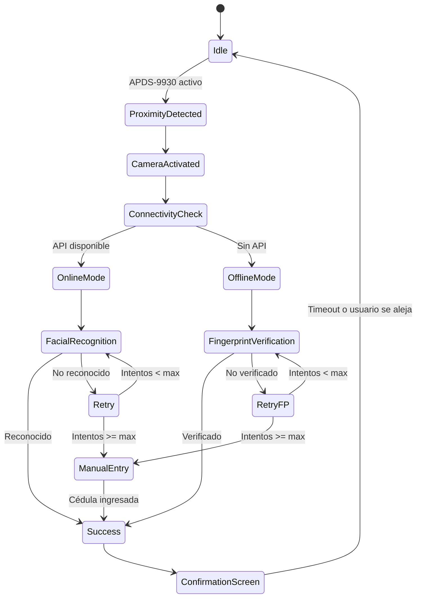

## 🔧 Desarrollo

### Configuración del Entorno de Desarrollo

#### 1. Preparación del Entorno
```bash
# Clonar repositorio
git clone https://github.com/empresa/biometric-terminal.git
cd biometric-terminal

# Crear entorno virtual
python3 -m venv venv
source venv/bin/activate  # Linux/Mac
# venv\Scripts\activate   # Windows

# Instalar dependencias de desarrollo
pip install -r requirements.txt
pip install -r requirements-dev.txt
```

#### 2. Variables de Entorno
```bash
# Crear archivo .env basado en .env.example
cp .env.example .env

# Editar variables de entorno
nano .env
```

**Contenido de .env:**
```bash
# Configuración del sistema
DEVICE_ID=TERMINAL_DEV_001
DEBUG_MODE=true
LOG_LEVEL=DEBUG

# Base de datos
DATABASE_PATH=data/database_dev.db

# API
API_BASE_URL=https://api-dev.empresa.com/biometric
API_KEY=dev_api_key_here
API_TIMEOUT=10

# Hardware (para testing sin hardware real)
MOCK_HARDWARE=true
MOCK_CAMERA=true
MOCK_FINGERPRINT=true
MOCK_PROXIMITY=true

# Seguridad
ADMIN_PASSWORD=admin123  # Solo para desarrollo
ENCRYPTION_KEY=dev_encryption_key
```

### Arquitectura de Clases Principales

#### CameraManager
```python
class CameraManager:
    """Gestión de cámara y detección facial"""
    
    def __init__(self, config: dict):
        self.config = config
        self.picam2 = None
        self.face_cascade = None
        self.is_active = False
    
    async def initialize(self) -> bool:
        """Inicializar cámara y clasificador"""
        
    async def start_preview(self) -> None:
        """Iniciar preview de cámara"""
        
    async def detect_faces(self, frame: np.ndarray) -> List[Dict]:
        """Detectar rostros en frame"""
        
    async def capture_for_recognition(self) -> bytes:
        """Capturar imagen optimizada para API"""
        
    async def stop_preview(self) -> None:
        """Detener preview y liberar recursos"""
```

#### FingerprintManager
```python
class FingerprintManager:
    """Comunicación con sensor AS608"""
    
    def __init__(self, uart_port: str, baud_rate: int):
        self.uart_port = uart_port
        self.baud_rate = baud_rate
        self.connection = None
    
    async def initialize(self) -> bool:
        """Inicializar comunicación UART"""
        
    async def enroll_fingerprint(self, user_id: int) -> Dict:
        """Registrar nueva huella en sensor"""
        
    async def verify_fingerprint(self) -> Dict:
        """Verificar huella contra base interna"""
        
    async def delete_fingerprint(self, template_id: int) -> bool:
        """Eliminar template del sensor"""
        
    async def get_template_count(self) -> int:
        """Obtener número de templates almacenados"""
```

#### DatabaseManager
```python
class DatabaseManager:
    """Gestión de base de datos SQLite"""
    
    def __init__(self, db_path: str):
        self.db_path = db_path
        self.connection = None
    
    async def initialize_database(self) -> None:
        """Crear estructura de BD si no existe"""
        
    async def create_user(self, user_data: Dict) -> int:
        """Crear nuevo usuario"""
        
    async def get_user_by_id(self, user_id: int) -> Optional[Dict]:
        """Obtener usuario por ID"""
        
    async def create_access_record(self, record_data: Dict) -> int:
        """Crear registro de acceso"""
        
    async def get_pending_sync_records(self) -> List[Dict]:
        """Obtener registros pendientes de sincronización"""
```

### Patrones de Diseño Implementados

#### 1. Singleton para Gestores Globales
```python
class StateManager:
    """Singleton para estado global de la aplicación"""
    _instance = None
    
    def __new__(cls):
        if cls._instance is None:
            cls._instance = super().__new__(cls)
        return cls._instance
    
    def __init__(self):
        if not hasattr(self, 'initialized'):
            self.current_mode = 'idle'
            self.is_online = False
            self.current_user = None
            self.initialized = True
```

#### 2. Observer para Eventos del Sistema
```python
class EventManager:
    """Patrón Observer para eventos del sistema"""
    
    def __init__(self):
        self.listeners = {}
    
    def subscribe(self, event_type: str, callback: Callable):
        """Suscribirse a evento"""
        if event_type not in self.listeners:
            self.listeners[event_type] = []
        self.listeners[event_type].append(callback)
    
    def publish(self, event_type: str, data: Any):
        """Publicar evento"""
        for callback in self.listeners.get(event_type, []):
            callback(data)
```

#### 3. Factory para Pantallas UI
```python
class ScreenFactory:
    """Factory para crear pantallas de UI"""
    
    @staticmethod
    def create_screen(screen_type: str, **kwargs) -> BaseScreen:
        screens = {
            'main': MainScreen,
            'admin': AdminScreen,
            'registration': RegistrationScreen,
            'manual_entry': ManualEntryScreen,
            'success': SuccessScreen
        }
        
        screen_class = screens.get(screen_type)
        if not screen_class:
            raise ValueError(f"Screen type '{screen_type}' not found")
        
        return screen_class(**kwargs)
```

### Flujo de Datos

#### 1. Reconocimiento Facial Online


#### 2. Verificación por Huella Offline


### Testing

#### 1. Tests Unitarios
```bash
# Ejecutar todos los tests
python -m pytest tests/

# Ejecutar tests específicos
python -m pytest tests/test_camera_manager.py -v

# Ejecutar con cobertura
python -m pytest --cov=core tests/
```

#### 2. Tests de Integración
```bash
# Tests de integración con hardware mock
MOCK_HARDWARE=true python -m pytest tests/test_integration.py

# Tests con hardware real (solo en dispositivo)
python -m pytest tests/test_hardware_integration.py
```

#### 3. Mock para Desarrollo sin Hardware
```python
class MockFingerprintManager:
    """Mock del FingerprintManager para desarrollo"""
    
    def __init__(self, *args, **kwargs):
        self.mock_templates = {1: "user_1", 2: "user_2"}
    
    async def verify_fingerprint(self) -> Dict:
        # Simular verificación exitosa
        return {
            "success": True,
            "template_id": 1,
            "confidence": 0.95
        }
```

### Debugging y Logging

#### 1. Configuración de Logs
```python
# utils/logger.py
import logging
from logging.handlers import RotatingFileHandler

def setup_logging(config: dict):
    """Configurar sistema de logging"""
    
    # Configurar formato
    formatter = logging.Formatter(
        '%(asctime)s - %(name)s - %(levelname)s - %(message)s'
    )
    
    # Handler para archivo
    file_handler = RotatingFileHandler(
        'logs/system.log',
        maxBytes=10*1024*1024,  # 10MB
        backupCount=5
    )
    file_handler.setFormatter(formatter)
    
    # Handler para consola
    console_handler = logging.StreamHandler()
    console_handler.setFormatter(formatter)
    
    # Configurar logger principal
    logger = logging.getLogger('biometric_terminal')
    logger.setLevel(getattr(logging, config.get('log_level', 'INFO')))
    logger.addHandler(file_handler)
    logger.addHandler(console_handler)
```

#### 2. Debugging de Hardware
```python
class HardwareDebugger:
    """Herramientas de debugging para hardware"""
    
    @staticmethod
    async def test_camera():
        """Test básico de cámara"""
        try:
            picam2 = Picamera2()
            picam2.start()
            frame = picam2.capture_array()
            picam2.stop()
            return {"success": True, "resolution": frame.shape}
        except Exception as e:
            return {"success": False, "error": str(e)}
    
    @staticmethod
    async def test_i2c_devices():
        """Escanear dispositivos I2C"""
        try:
            import smbus2
            bus = smbus2.SMBus(1)
            devices = []
            for addr in range(0x03, 0x78):
                try:
                    bus.read_byte(addr)
                    devices.append(hex(addr))
                except:
                    pass
            return {"success": True, "devices": devices}
        except Exception as e:
            return {"success": False, "error": str(e)}
```

### Performance y Optimización

#### 1. Optimizaciones de Cámara
```python
# Configuración optimizada para Pi Zero 2W
CAMERA_CONFIG = {
    "resolution": (640, 480),  # Resolución equilibrada
    "fps": 15,                 # FPS reducido para menor CPU
    "detection_interval": 3,   # Detectar cada 3 frames
    "quality": 85             # Calidad de compresión
}
```

#### 2. Pool de Conexiones para Base de Datos
```python
class DatabasePool:
    """Pool de conexiones para mejor rendimiento"""
    
    def __init__(self, db_path: str, pool_size: int = 5):
        self.db_path = db_path
        self.pool = asyncio.Queue(maxsize=pool_size)
        
    async def get_connection(self):
        """Obtener conexión del pool"""
        if self.pool.empty():
            return await aiosqlite.connect(self.db_path)
        return await self.pool.get()
    
    async def return_connection(self, conn):
        """Devolver conexión al pool"""
        await self.pool.put(conn)
```

#### 3. Cache para Usuarios Frecuentes
```python
from functools import lru_cache

class UserCache:
    """Cache LRU para usuarios frecuentes"""
    
    @lru_cache(maxsize=100)
    async def get_user_by_template_id(self, template_id: int):
        """Obtener usuario con cache"""
        return await self.db_manager.get_user_by_fingerprint_id(template_id)
```

## 🐛 Troubleshooting

### Problemas Comunes y Soluciones

#### 1. Cámara no Detectada

**Síntomas:**
- Error al ejecutar `libcamera-hello`
- Excepción en CameraManager.initialize()

**Soluciones:**
```bash
# Verificar conexión física
vcgencmd get_camera

# Habilitar cámara en raspi-config
sudo raspi-config
# → Interfacing Options → Camera → Enable

# Verificar configuración en /boot/firmware/config.txt
grep camera /boot/firmware/config.txt

# Debería mostrar:
# camera_auto_detect=1
# o
# dtoverlay=ov5647
```

#### 2. Sensor AS608 no Responde

**Síntomas:**
- Timeout en comunicación UART
- Error "Device not found"

**Diagnóstico:**
```bash
# Verificar dispositivo UART
ls -la /dev/serial*
ls -la /dev/ttyS*

# Verificar configuración UART
grep enable_uart /boot/firmware/config.txt
# Debería mostrar: enable_uart=1

# Test de comunicación
sudo minicom -D /dev/serial0 -b 9600
```

**Soluciones:**
```bash
# Configurar permisos UART
sudo usermod -a -G dialout $USER

# Deshabilitar login shell en UART (mantener hardware habilitado)
sudo raspi-config
# → Interfacing Options → Serial Port
# → Login shell: No
# → Serial hardware: Yes
```

#### 3. APDS-9930 no Detecta

**Síntomas:**
- No se activa proximidad
- Error I2C communication

**Diagnóstico:**
```bash
# Verificar I2C habilitado
grep dtparam=i2c_arm /boot/firmware/config.txt
# Debería mostrar: dtparam=i2c_arm=on

# Escanear dispositivos I2C
sudo i2cdetect -y 1
# APDS-9930 debería aparecer en 0x39
```

**Soluciones:**
```bash
# Habilitar I2C
sudo raspi-config
# → Interfacing Options → I2C → Enable

# Verificar conexiones físicas:
# VCC → 3.3V (Pin 1)
# GND → GND (Pin 6)  
# SDA → GPIO2 (Pin 3)
# SCL → GPIO3 (Pin 5)
```

#### 4. Pantalla Táctil no Funciona

**Síntomas:**
- Touch no registra eventos
- Pantalla muestra imagen pero no responde al toque

**Verificación:**
```bash
# Verificar eventos de input
sudo evtest
# Debería listar dispositivo como "ADS7846 Touchscreen"

# Verificar configuración touchscreen
cat /usr/share/X11/xorg.conf.d/99-calibration.conf
```

**Soluciones:**
```bash
# Verificar overlay en /boot/firmware/config.txt
grep ads7846 /boot/firmware/config.txt

# Configuración correcta:
dtoverlay=ads7846,cs=1,penirq=25,penirq_pull=2,speed=50000,keep_vref_on=0,swapxy=0,pmax=255,xohms=150

# Recalibrar touchscreen
sudo apt install xinput-calibrator
xinput_calibrator
```

#### 5. Sistema se Sobrecalienta

**Síntomas:**
- Throttling del CPU
- Rendimiento degradado
- Sistema se cuelga

**Monitoreo:**
```bash
# Verificar temperatura
vcgencmd measure_temp

# Verificar throttling
vcgencmd get_throttled
# 0x0 = OK, otros valores indican problemas

# Monitoreo en tiempo real
watch -n 1 'vcgencmd measure_temp && vcgencmd get_throttled'
```

**Soluciones:**
```bash
# Configurar límites en /boot/firmware/config.txt
temp_limit=70
initial_turbo=30

# Optimizar configuración de cámara
# Reducir FPS y resolución
# Procesar cada N frames en lugar de todos

# Mejorar ventilación física
# Agregar disipador de calor
# Mejorar flujo de aire
```

#### 6. Base de Datos Corrupta

**Síntomas:**
- Errores SQLite "database is locked"
- Datos inconsistentes

**Diagnóstico:**
```bash
# Verificar integridad
sqlite3 data/database.db "PRAGMA integrity_check;"

# Verificar locks
lsof data/database.db
```

**Recuperación:**
```bash
# Backup de seguridad
cp data/database.db data/database_backup.db

# Reparar base de datos
sqlite3 data/database.db ".backup main data/database_repaired.db"
mv data/database_repaired.db data/database.db

# Restaurar desde backup más reciente
ls -la data/backups/
cp data/backups/database_YYYY-MM-DD.db data/database.db
```

#### 7. Problemas de Conectividad API

**Síntomas:**
- Requests timeout
- SSL errors
- Certificados inválidos

**Diagnóstico:**
```bash
# Test básico de conectividad
ping api.empresa.com

# Test HTTPS
curl -I https://api.empresa.com/biometric/health

# Verificar certificados
openssl s_client -connect api.empresa.com:443
```

**Soluciones:**
```bash
# Actualizar certificados
sudo apt update && sudo apt install ca-certificates

# Configurar proxy si es necesario
export https_proxy=http://proxy.empresa.com:8080

# Verificar configuración DNS
cat /etc/resolv.conf
```

### Logs de Debugging

#### Ubicaciones de Logs
```bash
# Log principal del sistema
tail -f logs/system.log

# Log específico de accesos
tail -f logs/access.log

# Log de errores
tail -f logs/errors.log

# Log de comunicación API
tail -f logs/api.log

# Log de hardware
tail -f logs/hardware.log

# Logs del sistema operativo
sudo journalctl -u biometric-terminal.service -f
```

#### Interpretar Códigos de Error

**Códigos de Hardware:**
- `HW001`: Error de inicialización de cámara
- `HW002`: Error de comunicación UART (AS608)
- `HW003`: Error I2C (APDS-9930)
- `HW004`: Error de GPIO
- `HW005`: Error de touchscreen

**Códigos de API:**
- `API001`: Timeout de conexión
- `API002`: Error de autenticación
- `API003`: Error de formato de respuesta
- `API004`: Rate limit excedido
- `API005`: Servidor no disponible

**Códigos de Base de Datos:**
- `DB001`: Error de conexión
- `DB002`: Error de consulta SQL
- `DB003`: Violación de constraint
- `DB004`: Base de datos corrupta
- `DB005`: Espacio insuficiente

## 🔧 Mantenimiento

### Rutinas de Mantenimiento

#### 1. Mantenimiento Diario (Automatizado)
```bash
#!/bin/bash
# scripts/daily_maintenance.sh

# Rotar logs
find logs/ -name "*.log" -size +50M -exec logrotate {} \;

# Backup de base de datos
sqlite3 data/database.db ".backup data/backups/database_$(date +%Y-%m-%d).db"

# Limpiar backups antiguos (mantener 7 días)
find data/backups/ -name "database_*.db" -mtime +7 -delete

# Verificar integridad de BD
sqlite3 data/database.db "PRAGMA integrity_check;" >> logs/maintenance.log

# Monitorear espacio en disco
df -h / >> logs/disk_usage.log

# Verificar temperatura
vcgencmd measure_temp >> logs/temperature.log
```

#### 2. Mantenimiento Semanal
```bash
#!/bin/bash
# scripts/weekly_maintenance.sh

# Actualizar sistema (solo parches de seguridad)
sudo apt update
sudo apt list --upgradable | grep -i security

# Análisis de logs
awk '/ERROR|CRITICAL/' logs/system.log | tail -20

# Estadísticas de uso
sqlite3 data/database.db "
SELECT 
    DATE(timestamp) as date,
    COUNT(*) as total_access,
    SUM(CASE WHEN method='online' THEN 1 ELSE 0 END) as online_count,
    SUM(CASE WHEN method='offline' THEN 1 ELSE 0 END) as offline_count
FROM access_records 
WHERE timestamp >= DATE('now', '-7 days')
GROUP BY DATE(timestamp)
ORDER BY date;
"

# Verificar sincronización pendiente
sqlite3 data/database.db "SELECT COUNT(*) FROM access_records WHERE is_synced=0;"
```

#### 3. Mantenimiento Mensual
```bash
#!/bin/bash
# scripts/monthly_maintenance.sh

# Backup completo del sistema
tar -czf /tmp/biometric_backup_$(date +%Y-%m-%d).tar.gz \
    data/ logs/ assets/ config.json

# Optimizar base de datos
sqlite3 data/database.db "VACUUM;"
sqlite3 data/database.db "REINDEX;"

# Verificar salud del hardware
python3 -c "
from hardware.i2c_handler import I2CHandler
from hardware.uart_handler import UARTHandler
print('I2C Status:', I2CHandler.test_connection())
print('UART Status:', UARTHandler.test_connection())
"

# Análisis de rendimiento
python3 -c "
import psutil
print(f'CPU Usage: {psutil.cpu_percent()}%')
print(f'Memory Usage: {psutil.virtual_memory().percent}%')
print(f'Disk Usage: {psutil.disk_usage(\"/\").percent}%')
print(f'Temperature: {psutil.sensors_temperatures().get(\"cpu_thermal\", [{}])[0].current if psutil.sensors_temperatures() else \"N/A\"}°C')
"
```

### Actualizaciones de Software

#### 1. Actualización Automática
```bash
#!/bin/bash
# scripts/update.sh

# Verificar versión actual
CURRENT_VERSION=$(cat VERSION)
echo "Versión actual: $CURRENT_VERSION"

# Backup antes de actualizar
./scripts/backup.sh

# Detener servicio
sudo systemctl stop biometric-terminal.service

# Actualizar código
git fetch origin
git checkout main
git pull origin main

# Actualizar dependencias
source venv/bin/activate
pip install -r requirements.txt

# Ejecutar migraciones de BD si existen
python3 scripts/migrate_database.py

# Reiniciar servicio
sudo systemctl start biometric-terminal.service

# Verificar estado
sudo systemctl status biometric-terminal.service
```

#### 2. Rollback en Caso de Problemas
```bash
#!/bin/bash
# scripts/rollback.sh

# Obtener último backup
LAST_BACKUP=$(ls -t data/backups/ | head -1)

# Detener servicio
sudo systemctl stop biometric-terminal.service

# Restaurar base de datos
cp "data/backups/$LAST_BACKUP" data/database.db

# Volver a versión anterior
git checkout HEAD~1

# Reinstalar dependencias de versión anterior
pip install -r requirements.txt

# Reiniciar servicio
sudo systemctl start biometric-terminal.service
```

### Monitoreo del Sistema

#### 1. Health Check Endpoint Interno
```python
# /admin/health
{
    "status":# 🏢 Terminal Biométrica - Sistema de Control de Acceso

> Sistema híbrido de control de acceso con reconocimiento facial y verificación por huella dactilar, diseñado para funcionar tanto en modo online como offline.

[](https://python.org)
[](https://www.raspberrypi.org/)
[]()

## 📋 Tabla de Contenidos

1. [Descripción General](#descripción-general)
2. [Características](#características)
3. [Hardware Requerido](#hardware-requerido)
4. [Arquitectura del Sistema](#arquitectura-del-sistema)
5. [Instalación](#instalación)
6. [Configuración](#configuración)
7. [Uso del Sistema](#uso-del-sistema)
8. [API y Conectividad](#api-y-conectividad)
9. [Base de Datos](#base-de-datos)
10. [Estructura del Proyecto](#estructura-del-proyecto)
11. [Desarrollo](#desarrollo)
12. [Troubleshooting](#troubleshooting)
13. [Mantenimiento](#mantenimiento)
14. [Seguridad](#seguridad)
15. [Changelog](#changelog)

## 🎯 Descripción General

La **Terminal Biométrica** es un sistema de control de acceso empresarial que utiliza tecnología biométrica dual (reconocimiento facial + huella dactilar) para registrar la entrada y salida de empleados. El sistema está diseñado para ser robusto y funcional tanto con conexión a internet como en modo offline.

### Casos de Uso

- **Control de acceso empresarial**: Registro de entrada/salida de empleados
- **Gestión de tiempo laboral**: Seguimiento automatizado de horarios
- **Seguridad física**: Control de acceso a instalaciones
- **Modo híbrido**: Funcionamiento continuo sin dependencia de conectividad

### Modos de Operación

1. **Modo Online**: Reconocimiento facial vía API externa
2. **Modo Offline**: Verificación por huella dactilar local
3. **Modo Manual**: Entrada por cédula como fallback
4. **Modo Administrador**: Configuración y gestión del sistema

## ✨ Características

### 🔍 Detección y Reconocimiento
- **Detección facial en tiempo real** con OpenCV
- **Verificación por huella dactilar** usando sensor AS608
- **Sensor de proximidad** APDS-9930 para activación automática
- **Captura optimizada** para envío a API de reconocimiento

### 🌐 Conectividad Híbrida
- **Modo online**: Reconocimiento facial vía API REST
- **Modo offline**: Verificación local por huella dactilar
- **Sincronización automática** cuando se restaura la conexión
- **Health check periódico** de conectividad API

### 📱 Interfaz de Usuario
- **Pantalla táctil** 4" (800x400) en orientación vertical
- **Preview de cámara** en tiempo real
- **Feedback visual y sonoro** para interacciones
- **Pantallas de confirmación** con datos del usuario

### 🔧 Administración
- **Panel de administración** protegido por contraseña
- **Gestión de usuarios** (registro, modificación, eliminación)
- **Configuración de red** WiFi
- **Monitoreo de sistema** y logs
- **Backup y restore** de datos

### 💾 Persistencia de Datos
- **Base de datos SQLite** local
- **Queue de sincronización** para registros offline
- **Encriptación** de datos sensibles
- **Logs detallados** del sistema

## 🛠️ Hardware Requerido

### Componentes Principales

| Componente | Modelo | Función | Conexión |
|------------|--------|---------|----------|
| **Computadora** | Raspberry Pi Zero 2W | Procesamiento principal | - |
| **Pantalla** | LCD 4" 800x400 táctil | Interfaz de usuario | HDMI + GPIO |
| **Cámara** | OV5647 (Pi Camera v1) | Captura para reconocimiento facial | CSI |
| **Sensor Huella** | AS608 | Verificación biométrica offline | UART |
| **Sensor Proximidad** | APDS-9930 | Detección de presencia | I2C |
| **Speaker** | Mini speaker 3W | Feedback sonoro | GPIO/Audio Jack |

### Especificaciones Técnicas

#### Raspberry Pi Zero 2W
- **CPU**: ARM Cortex-A53 quad-core 1GHz
- **RAM**: 512MB LPDDR2
- **Conectividad**: WiFi 802.11n, Bluetooth 4.2
- **GPIO**: 40 pines
- **OS**: Raspberry Pi OS (32-bit)

#### Pantalla LCD 4"
- **Resolución**: 800x400 píxeles
- **Orientación**: Vertical (400x800 en uso)
- **Touch**: Capacitivo/Resistivo
- **Driver**: XPT2046 (touchscreen)

#### Cámara OV5647
- **Sensor**: 5MP CMOS
- **Resolución máxima**: 2592x1944
- **Video**: 1080p@30fps, 720p@60fps
- **Enfoque**: Fijo (optimizado para 2m)

#### AS608 Fingerprint Sensor
- **Capacidad**: 162 templates internos
- **Tiempo de identificación**: <1.5 segundos
- **FAR**: <0.001% (False Accept Rate)
- **FRR**: <1.0% (False Reject Rate)
- **Comunicación**: UART (9600 baud)

#### APDS-9930
- **Tipo**: Proximidad y luz ambiente
- **Rango**: 0-100mm (ajustable)
- **Comunicación**: I2C
- **Consumo**: <200µA en modo activo

### Conexiones Hardware

```

```bash
Raspberry Pi Zero 2W Pinout:
┌─────────────────────────────────────┐
│  3.3V  [1] [2]  5V                  │
│  GPIO2 [3] [4]  5V                  │
│  GPIO3 [5] [6]  GND                 │
│  GPIO4 [7] [8]  GPIO14 (UART TX)    │
│  GND   [9] [10] GPIO15 (UART RX)    │
│ ...                                 │
└─────────────────────────────────────┘

Conexiones:
AS608:
- VCC → Pin 1 (3.3V)
- GND → Pin 6 (GND)
- TX  → Pin 10 (GPIO15/UART RX)
- RX  → Pin 8 (GPIO14/UART TX)

APDS-9930:
- VCC → Pin 1 (3.3V)
- GND → Pin 6 (GND)
- SDA → Pin 3 (GPIO2/I2C SDA)
- SCL → Pin 5 (GPIO3/I2C SCL)

Touchscreen (XPT2046):
- T_VCC → Pin 1 (3.3V)
- T_GND → Pin 6 (GND)
- T_CS  → Pin 24 (GPIO8)
- T_CLK → Pin 23 (GPIO11)
- T_DIN → Pin 19 (GPIO10)
- T_DO  → Pin 21 (GPIO9)
- T_IRQ → Pin 22 (GPIO25)
```

## 🏗️ Arquitectura del Sistema

### Diagrama de Arquitectura



### Flujo de Estados



### Componentes del Sistema

#### Core Services
- **CameraManager**: Detección facial y captura
- **FingerprintManager**: Comunicación con AS608
- **ProximityManager**: Gestión del APDS-9930
- **APIManager**: Comunicación con servidor
- **DatabaseManager**: Persistencia local
- **AudioManager**: Feedback sonoro

#### UI Components
- **MainScreen**: Pantalla principal con preview
- **AdminScreen**: Panel de administración
- **RegistrationScreen**: Registro de usuarios
- **ManualEntryScreen**: Entrada manual por cédula
- **SuccessScreen**: Confirmación de acceso

#### Hardware Abstraction
- **I2CHandler**: Comunicación I2C (APDS-9930)
- **UARTHandler**: Comunicación UART (AS608)
- **GPIOHandler**: GPIO general

## 📦 Instalación

### Requisitos Previos

#### Sistema Operativo
```bash
# Raspberry Pi OS (32-bit) - Bookworm o superior
# Verificar versión
cat /etc/os-release
```

#### Configuración Inicial del Sistema
```bash
# Actualizar sistema
sudo apt update && sudo apt upgrade -y

# Habilitar interfaces necesarias
sudo raspi-config
# → Interface Options → I2C → Enable
# → Interface Options → Serial Port → Login shell: No, Serial hardware: Yes
# → Interface Options → Camera → Enable
```

#### Configuración de Hardware
```bash
# Editar /boot/firmware/config.txt
sudo nano /boot/firmware/config.txt

# Agregar configuraciones:
dtparam=i2c_arm=on
dtparam=spi=on
enable_uart=1
dtoverlay=vc4-kms-v3d
dtoverlay=ov5647,rotation=0  # Ajustar según orientación física
dtoverlay=ads7846,cs=1,penirq=25,penirq_pull=2,speed=50000,keep_vref_on=0,swapxy=0,pmax=255,xohms=150

# Configuración de pantalla para 800x400
hdmi_force_hotplug=1
hdmi_group=2
hdmi_mode=87
hdmi_cvt 800 400 60 6 0 0 0
display_rotate=1  # Rotación 90° para vertical
```

### Instalación Automatizada

```bash
# Clonar repositorio
git clone https://github.com/empresa/biometric-terminal.git
cd biometric-terminal

# Ejecutar script de instalación
chmod +x install.sh
sudo ./install.sh
```

### Instalación Manual

#### 1. Dependencias del Sistema
```bash
# Librerías base
sudo apt install -y python3-pip python3-venv git
sudo apt install -y python3-opencv opencv-data
sudo apt install -y sqlite3 libsqlite3-dev
sudo apt install -y portaudio19-dev python3-pyaudio
sudo apt install -y i2c-tools python3-smbus

# Herramientas de desarrollo
sudo apt install -y build-essential python3-dev
sudo apt install -y libatlas-base-dev libhdf5-dev
```

#### 2. Entorno Virtual Python
```bash
# Crear entorno virtual
python3 -m venv biometric_env
source biometric_env/bin/activate

# Instalar dependencias Python
pip install --upgrade pip
pip install -r requirements.txt
```

#### 3. Configuración de Base de Datos
```bash
# Crear estructura de base de datos
python3 -c "
from core.database_manager import DatabaseManager
db = DatabaseManager()
db.initialize_database()
print('Base de datos inicializada')
"
```

#### 4. Configuración de Servicios
```bash
# Crear servicio systemd
sudo cp biometric-terminal.service /etc/systemd/system/
sudo systemctl daemon-reload
sudo systemctl enable biometric-terminal.service
```

### Dependencias Python (requirements.txt)

```txt
# Core
opencv-python==4.8.1.78
numpy==1.24.3
Pillow==10.0.0

# Hardware
picamera2==0.3.12
RPi.GPIO==0.7.1
pyserial==3.5
smbus2==0.4.2

# Database
sqlite3  # Built-in

# UI
tkinter  # Built-in
pygame==2.5.2

# API
requests==2.31.0
urllib3==2.0.4

# Audio
pyaudio==0.2.13
pydub==0.25.1

# Utilities
python-dateutil==2.8.2
pytz==2023.3
cryptography==41.0.4
```

## ⚙️ Configuración

### Archivo de Configuración Principal

```json
{
  "system": {
    "device_id": "TERMINAL_001",
    "location": "Oficina Principal - Entrada",
    "timezone": "America/Bogota",
    "debug_mode": false,
    "log_level": "INFO"
  },
  "hardware": {
    "camera": {
      "resolution": [640, 480],
      "rotation": 0,
      "fps": 30,
      "detection_confidence": 0.7
    },
    "proximity": {
      "threshold_distance": 50,
      "activation_time": 1.0,
      "deactivation_time": 5.0
    },
    "fingerprint": {
      "uart_port": "/dev/serial0",
      "baud_rate": 9600,
      "timeout": 5.0,
      "max_attempts": 3
    },
    "display": {
      "resolution": [400, 800],
      "brightness": 80,
      "timeout": 30
    },
    "audio": {
      "enabled": true,
      "volume": 70,
      "success_sound": "assets/sounds/success.wav",
      "error_sound": "assets/sounds/error.wav"
    }
  },
  "api": {
    "base_url": "https://api.empresa.com/biometric",
    "endpoints": {
      "health": "/health",
      "recognize": "/recognize",
      "sync": "/sync"
    },
    "timeout": 10,
    "retry_attempts": 3,
    "api_key": "your_api_key_here"
  },
  "database": {
    "path": "data/database.db",
    "backup_interval": 3600,
    "max_backup_files": 7
  },
  "security": {
    "admin_password_hash": "hashed_password",
    "session_timeout": 300,
    "encryption_key": "your_encryption_key"
  },
  "sync": {
    "auto_sync": true,
    "sync_interval": 300,
    "max_queue_size": 1000,
    "retry_delay": 60
  }
}
```

### Configuraciones de Hardware Específicas

#### AS608 - Configuración UART
```bash
# Verificar puerto UART disponible
ls -la /dev/serial*

# Configurar permisos
sudo usermod -a -G dialout pi

# Verificar comunicación
sudo minicom -D /dev/serial0 -b 9600
```

#### APDS-9930 - Configuración I2C
```bash
# Verificar dispositivos I2C
sudo i2cdetect -y 1

# Debería mostrar dispositivo en dirección 0x39
#      0  1  2  3  4  5  6  7  8  9  a  b  c  d  e  f
# 30: -- -- -- -- -- -- -- -- -- 39 -- -- -- -- -- --
```

#### Cámara OV5647 - Verificación
```bash
# Verificar detección de cámara
libcamera-hello --list-cameras

# Output esperado:
# Available cameras
# 0 : ov5647 [2592x1944 10-bit GBRG] (/base/soc/i2c0mux/i2c@1/ov5647@36)
```

## 🖥️ Uso del Sistema

### Flujo de Usuario Final

#### 1. Activación por Proximidad
- Usuario se acerca al terminal (< 50cm)
- APDS-9930 detecta presencia
- Sistema activa cámara y pantalla
- Muestra preview en tiempo real

#### 2. Reconocimiento Biométrico

**Modo Online (Con internet):**
```
┌─────────────────────────────────────┐
│  🎥 RECONOCIMIENTO FACIAL           │
│                                     │
│  Posicione su rostro frente         │
│  a la cámara                        │
│                                     │
│  [   PREVIEW DE CÁMARA   ]          │
│                                     │
│  ● Detectando...                    │
└─────────────────────────────────────┘
```

**Modo Offline (Sin internet):**
```
┌─────────────────────────────────────┐
│  👆 VERIFICACIÓN POR HUELLA         │
│                                     │
│  Coloque su dedo en el sensor       │
│  de huella dactilar                 │
│                                     │
│        [SENSOR AS608]               │
│                                     │
│  ● Verificando...                   │
└─────────────────────────────────────┘
```

#### 3. Pantalla de Confirmación
```
┌─────────────────────────────────────┐
│  ✅ ACCESO AUTORIZADO               │
│                                     │
│  👤 Juan Pérez Gómez                │
│  🆔 CC: 12.345.678                  │
│  ⏰ 08:30 AM - 15 Jul 2025          │
│  📍 Entrada Principal               │
│                                     │
│  Bienvenido                         │
└─────────────────────────────────────┘
```

#### 4. Modo Manual (Fallback)
```
┌─────────────────────────────────────┐
│  📝 ENTRADA MANUAL                  │
│                                     │
│  No se pudo verificar identidad     │
│                                     │
│  Ingrese su número de cédula:       │
│  [    1 2 3 4 5 6 7 8    ]          │
│                                     │
│  [7] [8] [9]  [Borrar]              │
│  [4] [5] [6]  [Confirmar]           │
│  [1] [2] [3]                        │
│      [0]                            │
└─────────────────────────────────────┘
```

### Panel de Administración

#### Acceso al Panel
1. Mantener presionada esquina superior derecha por 3 segundos
2. Ingresar contraseña de administrador
3. Acceder al menú de configuración

#### Funciones Administrativas

**Gestión de Usuarios:**
- Registrar nuevo usuario (datos + huella)
- Modificar información existente
- Eliminar usuarios
- Ver historial de accesos

**Configuración del Sistema:**
- Configurar red WiFi
- Ajustar sensibilidad de proximidad
- Configurar sonidos
- Establecer horarios de operación

**Monitoreo y Mantenimiento:**
- Ver logs del sistema
- Estadísticas de uso
- Estado de hardware
- Backup/restore de datos

**Sincronización:**
- Forzar sincronización manual
- Ver cola de sincronización
- Configurar intervalos de sync

## 🌐 API y Conectividad

### Especificaciones de la API

#### Health Check Endpoint
```http
GET /api/v1/health
Content-Type: application/json
Authorization: Bearer {api_key}

Response:
{
  "status": "healthy",
  "timestamp": "2025-07-15T08:30:00Z",
  "version": "1.0.0"
}
```

#### Reconocimiento Facial
```http
POST /api/v1/recognize
Content-Type: multipart/form-data
Authorization: Bearer {api_key}

Body:
- device_id: "TERMINAL_001"
- timestamp: "2025-07-15T08:30:00Z"
- image: [archivo binario JPG]

Response Success:
{
  "success": true,
  "user": {
    "id": 123,
    "name": "Juan Pérez Gómez",
    "document_id": "12345678",
    "photo_url": "https://cdn.empresa.com/photos/123.jpg"
  },
  "confidence": 0.95
}

Response Failure:
{
  "success": false,
  "message": "Usuario no reconocido",
  "confidence": 0.45
}
```

#### Sincronización de Registros
```http
POST /api/v1/sync
Content-Type: application/json
Authorization: Bearer {api_key}

Body:
{
  "device_id": "TERMINAL_001",
  "records": [
    {
      "local_id": 1,
      "user_id": 123,
      "document_id": "12345678",
      "timestamp": "2025-07-15T08:30:00Z",
      "method": "offline",
      "verification_type": "fingerprint"
    }
  ]
}

Response:
{
  "success": true,
  "synced_count": 1,
  "failed_records": []
}
```

### Manejo de Conectividad

#### Monitor de Conexión
```python
# Pseudocódigo del monitor de conectividad
class ConnectivityMonitor:
    def __init__(self):
        self.is_online = False
        self.last_check = None
        self.check_interval = 30  # segundos
    
    async def check_connectivity(self):
        try:
            response = await api_client.health_check()
            self.is_online = response.status_code == 200
        except Exception:
            self.is_online = False
        
        self.last_check = datetime.now()
        return self.is_online
```

#### Queue de Sincronización
- **Almacenamiento local** de registros cuando offline
- **Sincronización automática** cuando se restaura conectividad
- **Retry logic** con backoff exponencial
- **Priorización** de registros por timestamp

## 💾 Base de Datos

### Esquema Completo

```sql
-- Tabla de usuarios
CREATE TABLE users (
    id INTEGER PRIMARY KEY AUTOINCREMENT,
    name TEXT NOT NULL,
    document_id TEXT UNIQUE NOT NULL,
    fingerprint_id INTEGER UNIQUE, -- ID interno del AS608 (1-162)
    photo_path TEXT,
    phone TEXT,
    email TEXT,
    department TEXT,
    position TEXT,
    is_active BOOLEAN DEFAULT 1,
    created_at TIMESTAMP DEFAULT CURRENT_TIMESTAMP,
    updated_at TIMESTAMP DEFAULT CURRENT_TIMESTAMP
);

-- Tabla de registros de acceso
CREATE TABLE access_records (
    id INTEGER PRIMARY KEY AUTOINCREMENT,
    user_id INTEGER,
    document_id TEXT, -- Para entradas manuales sin user_id
    timestamp TIMESTAMP NOT NULL,
    method TEXT NOT NULL, -- 'online' | 'offline'
    verification_type TEXT NOT NULL, -- 'facial' | 'fingerprint' | 'manual'
    confidence REAL, -- Para reconocimiento facial
    device_id TEXT NOT NULL,
    location TEXT,
    is_synced BOOLEAN DEFAULT 0,
    sync_attempts INTEGER DEFAULT 0,
    last_sync_attempt TIMESTAMP,
    created_at TIMESTAMP DEFAULT CURRENT_TIMESTAMP,
    FOREIGN KEY (user_id) REFERENCES users (id)
);

-- Cola de sincronización
CREATE TABLE sync_queue (
    id INTEGER PRIMARY KEY AUTOINCREMENT,
    record_id INTEGER,
    action TEXT NOT NULL, -- 'create_record' | 'create_user' | 'update_user'
    payload TEXT NOT NULL, -- JSON con datos a sincronizar
    attempts INTEGER DEFAULT 0,
    max_attempts INTEGER DEFAULT 5,
    last_attempt TIMESTAMP,
    status TEXT DEFAULT 'pending', -- 'pending' | 'success' | 'failed' | 'abandoned'
    error_message TEXT,
    created_at TIMESTAMP DEFAULT CURRENT_TIMESTAMP,
    FOREIGN KEY (record_id) REFERENCES access_records (id)
);

-- Configuraciones del sistema
CREATE TABLE system_config (
    key TEXT PRIMARY KEY,
    value TEXT NOT NULL,
    description TEXT,
    updated_at TIMESTAMP DEFAULT CURRENT_TIMESTAMP
);

-- Logs del sistema
CREATE TABLE system_logs (
    id INTEGER PRIMARY KEY AUTOINCREMENT,
    level TEXT NOT NULL, -- 'DEBUG' | 'INFO' | 'WARNING' | 'ERROR' | 'CRITICAL'
    component TEXT NOT NULL, -- Componente que generó el log
    message TEXT NOT NULL,
    details TEXT, -- Información adicional en JSON
    timestamp TIMESTAMP DEFAULT CURRENT_TIMESTAMP
);

-- Índices para optimización
CREATE INDEX idx_access_records_timestamp ON access_records(timestamp);
CREATE INDEX idx_access_records_user_id ON access_records(user_id);
CREATE INDEX idx_access_records_sync ON access_records(is_synced, sync_attempts);
CREATE INDEX idx_sync_queue_status ON sync_queue(status, attempts);
CREATE INDEX idx_system_logs_level ON system_logs(level, timestamp);
```

### Operaciones Comunes

#### Registro de Acceso Online
```sql
-- Insertar registro exitoso online
INSERT INTO access_records (
    user_id, timestamp, method, verification_type, 
    confidence, device_id, location, is_synced
) VALUES (
    123, '2025-07-15 08:30:00', 'online', 'facial',
    0.95, 'TERMINAL_001', 'Entrada Principal', 1
);
```

#### Registro de Acceso Offline
```sql
-- Insertar registro offline para sincronizar después
INSERT INTO access_records (
    user_id, timestamp, method, verification_type,
    device_id, location, is_synced
) VALUES (
    123, '2025-07-15 08:30:00', 'offline', 'fingerprint',
    'TERMINAL_001', 'Entrada Principal', 0
);

-- Agregar a cola de sincronización
INSERT INTO sync_queue (record_id, action, payload) VALUES (
    last_insert_rowid(), 'create_record',
    '{"user_id": 123, "timestamp": "2025-07-15T08:30:00Z", ...}'
);
```

#### Consultas de Reportes
```sql
-- Registros del día actual
SELECT u.name, u.document_id, ar.timestamp, ar.verification_type
FROM access_records ar
LEFT JOIN users u ON ar.user_id = u.id
WHERE DATE(ar.timestamp) = DATE('now')
ORDER BY ar.timestamp DESC;

-- Estadísticas por método
SELECT 
    method,
    verification_type,
    COUNT(*) as count,
    DATE(timestamp) as date
FROM access_records
WHERE timestamp >= DATE('now', '-7 days')
GROUP BY method, verification_type, DATE(timestamp);

-- Registros pendientes de sincronización
SELECT COUNT(*) as pending_records
FROM access_records
WHERE is_synced = 0;
```

## 📁 Estructura del Proyecto

### Estructura Detallada de Directorios

```
biometric_terminal/
├── 📁 core/                           # Componentes principales del sistema
│   ├── __init__.py
│   ├── camera_manager.py              # Gestión de cámara y detección facial
│   ├── fingerprint_manager.py         # Comunicación con AS608
│   ├── proximity_manager.py           # Gestión del APDS-9930
│   ├── api_manager.py                 # Cliente API REST
│   ├── database_manager.py            # ORM y operaciones de BD
│   ├── audio_manager.py               # Sistema de sonidos
│   └── connectivity_monitor.py        # Monitor de conectividad
│
├── 📁 ui/                             # Interfaces de usuario
│   ├── __init__.py
│   ├── base_screen.py                 # Clase base para pantallas
│   ├── main_screen.py                 # Pantalla principal con preview
│   ├── admin_screen.py                # Panel de administración
│   ├── registration_screen.py         # Registro de usuarios
│   ├── manual_entry_screen.py         # Entrada manual por cédula
│   ├── success_screen.py              # Confirmación de acceso
│   ├── loading_screen.py              # Pantalla de carga
│   └── error_screen.py                # Pantalla de errores
│
├── 📁 utils/                          # Utilidades del sistema
│   ├── __init__.py
│   ├── config.py                      # Gestor de configuraciones
│   ├── logger.py                      # Sistema de logging
│   ├── crypto.py                      # Encriptación y seguridad
│   ├── state_manager.py               # Estado global de la aplicación
│   ├── validators.py                  # Validadores de datos
│   └── decorators.py                  # Decoradores útiles
│
├── 📁 models/                         # Modelos de datos
│   ├── __init__.py
│   ├── user.py                        # Modelo de usuario
│   ├── access_record.py               # Modelo de registro de acceso
│   ├── sync_queue.py                  # Modelo de cola de sincronización
│   └── system_config.py               # Modelo de configuración
│
├── 📁 hardware/                       # Abstracción de hardware
│   ├── __init__.py
│   ├── i2c_handler.py                 # Comunicación I2C (APDS-9930)
│   ├── uart_handler.py                # Comunicación UART (AS608)
│   ├── gpio_handler.py                # GPIO general
│   └── camera_handler.py              # Abstracción de cámara
│
├── 📁 services/                       # Servicios de negocio
│   ├── __init__.py
│   ├── enrollment_service.py          # Servicio de registro de usuarios
│   ├── verification_service.py        # Servicio de verificación biométrica
│   ├── sync_service.py                # Servicio de sincronización
│   ├── backup_service.py              # Servicio de backup
│   └── health_service.py              # Monitoreo de salud del sistema
│
├── 📁 data/                           # Datos persistentes
│   ├── database.db                    # Base de datos SQLite
│   ├── config.json                    # Configuraciones principales
│   ├── device_id.txt                  # Identificador único del dispositivo
│   └── backups/                       # Backups automáticos
│       ├── database_2025-07-15.db
│       └── config_2025-07-15.json
│
├── 📁 logs/                           # Archivos de log
│   ├── system.log                     # Log principal del sistema
│   ├── access.log                     # Log de accesos
│   ├── errors.log                     # Log de errores
│   ├── api.log                        # Log de comunicación API
│   └── hardware.log                   # Log de comunicación hardware
│
├── 📁 assets/                         # Recursos del sistema
│   ├── 📁 sounds/                     # Archivos de audio
│   │   ├── success.wav                # Sonido de éxito
│   │   ├── error.wav                  # Sonido de error
│   │   ├── beep.wav                   # Beep general
│   │   └── welcome.wav                # Sonido de bienvenida
│   ├── 📁 icons/                      # Iconos de la interfaz
│   │   ├── user.png                   # Icono de usuario
│   │   ├── settings.png               # Icono de configuración
│   │   ├── fingerprint.png            # Icono de huella
│   │   └── camera.png                 # Icono de cámara
│   ├── 📁 fonts/                      # Fuentes personalizadas
│   │   ├── Roboto-Regular.ttf
│   │   └── Roboto-Bold.ttf
│   └── 📁 images/                     # Imágenes del sistema
│       ├── logo.png                   # Logo de la empresa
│       └── background.png             # Fondo de pantalla
│
├── 📁 tests/                          # Tests unitarios e integración
│   ├── __init__.py
│   ├── test_camera_manager.py
│   ├── test_fingerprint_manager.py
│   ├── test_database_manager.py
│   ├── test_api_manager.py
│   └── test_integration.py
│
├── 📁 scripts/                        # Scripts de utilidad
│   ├── install.sh                     # Script de instalación
│   ├── update.sh                      # Script de actualización
│   ├── backup.sh                      # Script de backup manual
│   ├── restore.sh                     # Script de restauración
│   └── maintenance.sh                 # Script de mantenimiento
│
├── 📁 docs/                           # Documentación
│   ├── API.md                         # Documentación de API
│   ├── HARDWARE.md                    # Guía de hardware
│   ├── DEPLOYMENT.md                  # Guía de despliegue
│   └── TROUBLESHOOTING.md             # Guía de solución de problemas
│
├── 📄 requirements.txt                # Dependencias Python
├── 📄 biometric-terminal.service      # Servicio systemd
├── 📄 .env.example                    # Ejemplo de variables de entorno
├── 📄 .gitignore                      # Archivos ignorados por Git
├── 📄 LICENSE                         # Licencia del software
├── 📄 CHANGELOG.md                    # Historial de cambios
├── 📄 README.md                       # Este archivo
└── 📄 main.py                         # Punto de entrada principal