# 🔧 Terminal Biométrica - Documentación Técnica del Sistema

> Sistema de control de acceso biométrico híbrido (online/offline) que combina reconocimiento facial y verificación por huella dactilar. Este documento explica el concepto del dispositivo, su lógica de funcionamiento y la arquitectura del código implementado.

## ⚠️ Estado Actual del Proyecto

**VERSIÓN ACTUAL:** Implementación con módulos funcionales core + ejemplo de referencia (`terminal_app.py`)

### ✅ Componentes Implementados y Funcionales:
- **Sistema de Configuración**: Gestión completa con variables de entorno y archivos JSON
- **Sistema de Logging**: Logging estructurado con contexto, rendimiento y errores
- **Base de Datos Local**: SQLite con patrón Local-First completamente implementado
- **Gestión de Estados**: Máquina de estados centralizada con 9 estados y transiciones validadas
- **Cliente API**: Cliente completo para comunicación con servidor FastAPI
- **Servicio de Verificación**: Orquestación de métodos biométricos con fallback automático
- **Sistema UI Completo**: Interfaz pygame con 4 pantallas y componentes especializados
- **Aplicación Principal**: `main.py` con integración completa de todos los componentes

### 🔄 Implementaciones de Referencia:
- **`terminal_app.py`**: Ejemplo funcional con tkinter que demuestra integración API + detección facial
- **Abstracción de Hardware**: Marco preparado para sensores específicos

### ❌ Pendiente de Implementación:
- Drivers específicos de hardware (cámara, sensor AS608, APDS-9930)
- Servicios de enrollment y sincronización avanzada
- Pruebas en hardware real

## 📋 Tabla de Contenidos

1. [Concepto del Dispositivo](#-concepto-del-dispositivo)
2. [Cómo Ejecutar el Sistema](#-cómo-ejecutar-el-sistema)
3. [Lógica de Funcionamiento](#-lógica-de-funcionamiento)
4. [Arquitectura del Sistema](#️-arquitectura-del-sistema)
5. [Estructura del Código](#-estructura-del-código)
6. [Funcionamiento de los Módulos](#-funcionamiento-de-los-módulos)
7. [Flujo de Ejecución](#-flujo-de-ejecución)
8. [Gestión de Estados](#-gestión-de-estados)
9. [Comunicación Entre Módulos](#-comunicación-entre-módulos)
10. [Persistencia de Datos](#-persistencia-de-datos)
11. [Casos de Uso del Código](#-casos-de-uso-del-código)

## 🎯 Concepto del Dispositivo

### ¿Qué es?
Un dispositivo **autónomo** de control de acceso que opera bajo el principio de **funcionamiento híbrido inteligente**:
- **Modo Online**: Reconocimiento facial vía API cuando hay conectividad
- **Modo Offline**: Verificación por huella usando sensor local cuando no hay conectividad  
- **Modo Manual**: Entrada por cédula como fallback cuando fallan los métodos biométricos

### Hardware Principal
- **Raspberry Pi Zero 2W**: Procesamiento central
- **Pantalla táctil 4"**: Interfaz usuario (400x800 vertical)
- **Cámara OV5647**: Captura para reconocimiento facial
- **Sensor AS608**: Verificación de huella (almacena hasta 162 templates internamente)
- **Sensor APDS-9930**: Detección de proximidad para activación automática

### Principio de Operación
1. **Detección de proximidad** → Activa el sistema
2. **Evaluación de conectividad** → Decide qué modo usar
3. **Identificación biométrica** → Facial (online) o huella (offline)
4. **Registro local** → Siempre guarda en SQLite local
5. **Sincronización** → Envía a servidor cuando hay conectividad

## 🚀 Cómo Ejecutar el Sistema

### Instalación y Configuración

```bash
# Clonar el repositorio
git clone <repository-url>
cd bioentry-terminal-firmware

# Instalar dependencias principales
pip install -r requirements.txt

# Instalar dependencias UI (opcional, para demo)
pip install -r ui_requirements.txt
```

### Configuración del Sistema

```bash
# Configurar variables de entorno para desarrollo (sin hardware)
export MOCK_HARDWARE=true
export MOCK_CAMERA=true
export MOCK_FINGERPRINT=true  
export MOCK_PROXIMITY=true
export DEBUG_MODE=true

# Configurar API (opcional)
export API_BASE_URL="http://localhost:8000"
export TERMINAL_ID="TERMINAL_DEV_001"
export API_KEY="your_api_key_here"
```

### Ejecución de la Aplicación Principal

```bash
# Ejecutar aplicación principal con UI pygame completa
python main.py

# Controles durante ejecución:
# F1 - Activación manual
# F2 - Modo entrada manual
# F3 - Pantalla administrador  
# F4 - Simular verificación exitosa
# F5 - Volver a pantalla principal
# ESC - Salir
```

### Ejecución del Ejemplo de Referencia

```bash
# Ejecutar ejemplo funcional con tkinter (demuestra integración API)
python terminal_app.py

# Este ejemplo muestra:
# - Detección facial con OpenCV
# - Integración con API de BioEntry
# - Interfaz táctil optimizada
# - Modo online/offline
```

### Demo Interactivo del Sistema UI

```bash
# Ejecutar demo independiente del sistema UI
python ui_demo.py

# Controles del demo:
# ESC - Salir
# F1-F5 - Navegar entre pantallas
# Automáticamente simula proximidad y verificaciones
```

### Pruebas del Sistema

```bash
# Ejecutar pruebas básicas de componentes
python test_system.py

# Probar base de datos
python -c "from core.database_manager import get_database_manager; import asyncio; asyncio.run(get_database_manager())"

# Probar configuración
python utils/config.py

# Probar state manager
python utils/state_manager.py
```

### Estructura de Archivos de Configuración

El sistema crea automáticamente:
```
data/
├── config.json          # Configuración principal
├── database.db          # Base de datos SQLite
└── logs/
    └── terminal.log     # Logs del sistema
```

## 🧠 Lógica de Funcionamiento

### Estados del Sistema


### Algoritmo de Decisión
```python
def determine_operation_mode():
    if connectivity_monitor.is_online() and api_manager.health_check():
        return "FACIAL_RECOGNITION"
    elif fingerprint_manager.is_available():
        return "FINGERPRINT_VERIFICATION"
    else:
        return "MANUAL_ENTRY"
```

### Lógica de Sincronización
- **Local First**: Todo se guarda primero en SQLite local (✅ Implementado)
- **Background Sync**: Sincronización en segundo plano cuando hay conectividad (✅ Implementado)
- **Queue Management**: Cola de registros pendientes con retry inteligente (✅ Implementado)
- **Conflict Resolution**: Timestamp-based para resolver conflictos (✅ Implementado)

## 🏗️ Arquitectura del Sistema

### Principios de Diseño

#### 1. Separación por Responsabilidades
- **Core**: Lógica de negocio pura
- **Hardware**: Abstracción de dispositivos físicos  
- **UI**: Interfaz de usuario
- **Services**: Orquestación de operaciones complejas
- **Models**: Estructuras de datos
- **Utils**: Funcionalidad compartida

#### 2. Patrón Observer para Eventos
```python
# Ejemplo de arquitectura de eventos
event_manager.subscribe("user_detected", camera_manager.start_preview)
event_manager.subscribe("face_recognized", database_manager.create_record)
event_manager.subscribe("sync_needed", sync_service.add_to_queue)
```

#### 3. Máquina de Estados Centralizada
```python
class StateManager:
    def transition_to(self, new_state, data=None):
        # Validar transición
        # Cleanup estado anterior  
        # Setup nuevo estado
        # Notificar cambio
```

## 📁 Estructura del Código

```
bioentry-terminal-firmware/
├── main.py                          # ✅ Aplicación principal - pygame + integración completa
├── terminal_app.py                  # 🔄 Ejemplo funcional tkinter (referencia de integración)
├── core/                            # ✅ Lógica de negocio principal (IMPLEMENTADO)
│   ├── camera_manager.py            # 🔄 Detección facial + captura para API (base implementada)
│   ├── camera_manager_simple.py     # ✅ Gestor de cámara simple para pruebas
│   ├── fingerprint_manager.py       # 🔄 Comandos al AS608 (framework preparado)
│   ├── proximity_manager.py         # 🔄 APDS-9930 - activación automática (framework preparado)
│   ├── database_manager.py          # ✅ SQLite local - CRUD operaciones (COMPLETO)
│   ├── audio_manager.py             # 🔄 Sonidos de confirmación/error (framework preparado)
│   └── connectivity_monitor.py      # 🔄 Health check periódico de API (framework preparado)
├── ui/                              # ✅ Interfaces de usuario (COMPLETAS - pygame)
│   ├── base_ui.py                   # ✅ Sistema base UI + componentes
│   ├── main_screen.py               # ✅ Preview cámara + detección tiempo real
│   ├── admin_screen.py              # ✅ Panel configuración + gestión usuarios
│   ├── registration_screen.py       # ✅ Proceso enrollment huella
│   ├── manual_entry_screen.py       # ✅ Teclado numérico cédula
│   └── success_screen.py            # ✅ Confirmación con datos usuario
├── hardware/                        # 🔄 Abstracción de hardware (framework preparado)
│   ├── gpio_handler.py              # 🔄 GPIO básico
│   ├── i2c_handler.py               # 🔄 Comunicación I2C (APDS-9930)
│   └── uart_handler.py              # 🔄 Comunicación UART (AS608)
├── services/                        # ✅ Servicios de alto nivel (IMPLEMENTADOS)
│   ├── api_client.py                # ✅ Cliente API completo con retry y parsing
│   ├── enrollment_service.py        # 🔄 Proceso completo registro usuario (framework)
│   ├── verification_service.py      # ✅ Orquestación facial vs huella + fallback
│   └── sync_service.py              # ✅ Gestión cola sincronización con retry
├── models/                          # ✅ Estructuras de datos (IMPLEMENTADAS)
│   ├── user.py                      # ✅ Clase User con validaciones
│   ├── access_record.py             # ✅ Clase AccessRecord
│   └── sync_queue.py                # ✅ Clase SyncQueueItem
├── utils/                           # ✅ Utilidades compartidas (COMPLETAS)
│   ├── config.py                    # ✅ ConfigManager - JSON + env vars (COMPLETO)
│   ├── logger.py                    # ✅ Logging estructurado con contexto
│   ├── state_manager.py             # ✅ Máquina estados con timeouts y callbacks
│   └── crypto.py                    # ✅ Utilidades criptográficas
├── data/                            # ✅ Datos persistentes
│   ├── database.db                  # ✅ SQLite - esquema completo implementado
│   ├── config.json                  # ✅ Configuración del dispositivo
│   └── logs/                        # ✅ Archivos de log rotativos
├── docs/                            # ✅ Documentación
│   └── API_INTEGRATION.md           # ✅ Documentación integración API
├── ui_demo.py                       # ✅ Demo interactivo del sistema UI
├── ui_requirements.txt              # ✅ Dependencias específicas UI
└── test_system.py                   # ✅ Sistema de pruebas básicas

LEYENDA:
✅ Implementado y funcional
🔄 Framework/base implementada, necesita hardware específico
❌ Pendiente de implementación
```

## 🔧 Funcionamiento de los Módulos

### Core Modules

#### camera_manager.py
```python
class CameraManager:
    """Gestiona detección facial y captura para API"""
    
    def __init__(self, config):
        self.picam2 = None
        self.face_cascade = cv2.CascadeClassifier(...)
        self.is_preview_active = False
    
    async def start_preview(self):
        """Inicia preview para UI + detección en tiempo real"""
        self.picam2.start()
        self.is_preview_active = True
    
    async def detect_faces(self) -> List[Dict]:
        """
        Detecta rostros en frame actual
        Returns: [{"x": 100, "y": 50, "w": 150, "h": 200, "confidence": 0.8}]
        """
        frame = self.picam2.capture_array()
        # Procesar con OpenCV...
        return detected_faces
    
    async def capture_for_recognition(self) -> bytes:
        """
        Captura imagen optimizada para envío a API
        Returns: JPEG bytes optimizado para reconocimiento
        """
        # Captura en alta calidad
        # Optimiza tamaño/compresión
        return jpeg_bytes
    
    async def stop_preview(self):
        """Libera recursos de cámara"""
        self.picam2.stop()
        self.is_preview_active = False
```

#### fingerprint_manager.py
```python
class FingerprintManager:
    """Comunicación con sensor AS608 - NO almacena templates"""
    
    def __init__(self, uart_port="/dev/serial0"):
        self.uart = None
        self.port = uart_port
    
    async def enroll_fingerprint(self, user_id: int) -> Dict:
        """
        Registra nueva huella en sensor AS608
        Returns: {"success": True, "template_id": 45, "quality": 85}
        """
        # 1. Encontrar slot libre en sensor (1-162)
        # 2. Capturar huella 3 veces
        # 3. Crear template y almacenar en sensor
        # 4. Retornar template_id para asociar con user_id
    
    async def verify_fingerprint(self) -> Dict:
        """
        Verifica huella contra base interna del sensor
        Returns: {"success": True, "template_id": 23, "confidence": 95}
        """
        # 1. Sensor hace matching interno
        # 2. Retorna template_id si encuentra match
        # 3. NO retorna datos de usuario (eso lo hace database_manager)
    
    async def delete_template(self, template_id: int) -> bool:
        """Elimina template del sensor AS608"""
        # Comando para borrar template específico
    
    async def get_template_count(self) -> int:
        """Retorna número de templates almacenados en sensor"""
```

#### database_manager.py
```python
class DatabaseManager:
    """Gestión de SQLite local - única fuente de verdad local"""
    
    async def create_user(self, user_data: Dict) -> int:
        """
        Crea usuario en base local
        Args: {"name": "Juan", "document_id": "12345", "fingerprint_template_id": 23}
        Returns: user_id generado
        """
    
    async def get_user_by_fingerprint_id(self, template_id: int) -> Optional[Dict]:
        """
        Busca usuario por template_id del AS608
        Critical para modo offline: template_id -> user_data
        """
    
    async def create_access_record(self, record: Dict) -> int:
        """
        Crea registro de acceso - SIEMPRE local primero
        Args: {"user_id": 1, "timestamp": "...", "method": "online", "verification_type": "facial"}
        """
    
    async def get_pending_sync_records(self) -> List[Dict]:
        """Retorna registros no sincronizados para sync_service"""
    
    async def mark_as_synced(self, record_id: int):
        """Marca registro como sincronizado exitosamente"""
```

#### api_manager.py
```python
class APIManager:
    """Cliente HTTP para comunicación con servidor"""
    
    async def health_check(self) -> bool:
        """Ping rápido para verificar disponibilidad"""
        try:
            response = await self.session.get(f"{self.base_url}/health", timeout=3)
            return response.status == 200
        except:
            return False
    
    async def recognize_face(self, image_bytes: bytes) -> Dict:
        """
        Envía imagen para reconocimiento facial
        Returns: {"success": True, "user": {"id": 1, "name": "Juan", ...}, "confidence": 0.95}
        """
    
    async def sync_access_record(self, record: Dict) -> bool:
        """Envía registro de acceso al servidor"""
        
    async def sync_user_data(self, user: Dict) -> bool:
        """Sincroniza datos de usuario con servidor"""
```

### UI Modules

#### main_screen.py
```python
class MainScreen:
    """Pantalla principal - preview + detección en tiempo real"""
    
    def __init__(self, camera_manager, state_manager):
        self.camera_manager = camera_manager
        self.state_manager = state_manager
        self.detection_overlay = None
    
    async def show_facial_recognition_mode(self):
        """
        Modo online: muestra preview con rectángulos de detección
        """
        # Iniciar preview de cámara
        await self.camera_manager.start_preview()
        
        # Loop de detección + UI update
        while self.state_manager.current_state == SystemState.FACIAL_RECOGNITION:
            faces = await self.camera_manager.detect_faces()
            self.update_detection_overlay(faces)
            await asyncio.sleep(0.1)
    
    async def show_fingerprint_mode(self):
        """
        Modo offline: UI para colocación de dedo
        """
        # Mostrar instrucciones + animación sensor
        # Esperar eventos de fingerprint_manager
    
    def update_detection_overlay(self, faces: List[Dict]):
        """Dibuja rectángulos sobre rostros detectados"""
        # Actualiza UI con rectángulos verdes sobre caras
```

### Services Modules

#### verification_service.py
```python
class VerificationService:
    """Orquesta el proceso completo de verificación"""
    
    def __init__(self, camera_manager, fingerprint_manager, api_manager, database_manager):
        self.camera_manager = camera_manager
        self.fingerprint_manager = fingerprint_manager
        self.api_manager = api_manager
        self.database_manager = database_manager
    
    async def perform_facial_verification(self) -> Dict:
        """
        Proceso completo de verificación facial
        Returns: {"success": True, "user_data": {...}, "method": "facial"}
        """
        # 1. Capturar imagen optimizada
        image_data = await self.camera_manager.capture_for_recognition()
        
        # 2. Enviar a API
        api_result = await self.api_manager.recognize_face(image_data)
        
        # 3. Procesar resultado
        if api_result["success"]:
            return {
                "success": True,
                "user_data": api_result["user"],
                "method": "facial",
                "confidence": api_result["confidence"]
            }
        else:
            return {"success": False, "error": "not_recognized"}
    
    async def perform_fingerprint_verification(self) -> Dict:
        """
        Proceso completo de verificación por huella
        """
        # 1. Verificar con AS608
        fp_result = await self.fingerprint_manager.verify_fingerprint()
        
        if fp_result["success"]:
            # 2. Buscar datos de usuario en base local
            user_data = await self.database_manager.get_user_by_fingerprint_id(
                fp_result["template_id"]
            )
            
            if user_data:
                return {
                    "success": True,
                    "user_data": user_data,
                    "method": "fingerprint",
                    "confidence": fp_result["confidence"]
                }
        
        return {"success": False, "error": "not_verified"}
```

#### sync_service.py
```python
class SyncService:
    """Gestiona cola de sincronización con retry inteligente"""
    
    async def add_to_sync_queue(self, record_id: int, action: str = "create_record"):
        """Agrega registro a cola de sincronización"""
        sync_item = {
            "record_id": record_id,
            "action": action,
            "attempts": 0,
            "created_at": datetime.now()
        }
        await self.database_manager.create_sync_queue_item(sync_item)
    
    async def process_sync_queue(self):
        """
        Procesa cola de sincronización con backoff exponencial
        """
        pending_items = await self.database_manager.get_pending_sync_items()
        
        for item in pending_items:
            # Calcular delay según número de intentos
            delay = min(2 ** item["attempts"], 300)  # max 5 minutos
            
            if self.should_retry(item, delay):
                success = await self.attempt_sync(item)
                
                if success:
                    await self.database_manager.mark_sync_successful(item["id"])
                else:
                    await self.database_manager.increment_sync_attempts(item["id"])
```

## ⚡ Flujo de Ejecución

### 1. Inicialización del Sistema

```python
# main.py
async def main():
    """Punto de entrada principal"""
    
    # 1. Cargar configuración
    config = ConfigManager.load_config()
    
    # 2. Inicializar managers en orden de dependencia
    # Hardware primero
    proximity_manager = ProximityManager(config.hardware.proximity)
    camera_manager = CameraManager(config.hardware.camera)
    fingerprint_manager = FingerprintManager(config.hardware.fingerprint)
    
    # Core services
    database_manager = DatabaseManager(config.database.path)
    api_manager = APIManager(config.api)
    connectivity_monitor = ConnectivityMonitor(api_manager)
    
    # High-level services  
    verification_service = VerificationService(
        camera_manager, fingerprint_manager, api_manager, database_manager
    )
    sync_service = SyncService(database_manager, api_manager)
    
    # UI
    ui_manager = UIManager(camera_manager)
    
    # Estado global
    state_manager = StateManager()
    event_manager = EventManager()
    
    # 3. Configurar event listeners
    setup_event_listeners(event_manager, state_manager, ui_manager)
    
    # 4. Inicializar hardware
    await initialize_hardware()
    
    # 5. Iniciar bucle principal
    await main_operation_loop()

async def main_operation_loop():
    """Bucle principal del sistema"""
    
    while True:
        current_state = state_manager.get_current_state()
        
        # Dispatch a handler según estado actual
        handler = {
            SystemState.IDLE: handle_idle_state,
            SystemState.ACTIVATION: handle_activation_state,
            SystemState.FACIAL_RECOGNITION: handle_facial_recognition_state,
            SystemState.FINGERPRINT_VERIFICATION: handle_fingerprint_verification_state,
            SystemState.MANUAL_ENTRY: handle_manual_entry_state,
            SystemState.CONFIRMATION: handle_confirmation_state
        }
        
        await handler[current_state]()
        
        # Procesar eventos pendientes
        await event_manager.process_pending_events()
        
        # Procesar sincronización en background
        if connectivity_monitor.is_online():
            await sync_service.process_sync_queue()
        
        # Pequeña pausa para no saturar CPU
        await asyncio.sleep(0.1)
```

### 2. Handlers de Estados

```python
async def handle_idle_state():
    """Estado de reposo - solo proximity activo"""
    
    # Verificar proximidad
    proximity_detected = await proximity_manager.check_proximity()
    
    if proximity_detected:
        logger.info("Usuario detectado - activando sistema")
        
        # Despertar pantalla
        await ui_manager.wake_screen()
        
        # Transición a activación
        state_manager.transition_to(SystemState.ACTIVATION)
        
        # Publicar evento
        await event_manager.publish("user_detected", {"timestamp": datetime.now()})

async def handle_activation_state():
    """Determinar modo de operación"""
    
    # Evaluar conectividad
    is_online = await connectivity_monitor.is_online()
    api_responsive = await api_manager.health_check()
    
    if is_online and api_responsive:
        # Modo online - facial recognition
        logger.info("Modo online: reconocimiento facial")
        await ui_manager.show_facial_recognition_screen()
        state_manager.transition_to(SystemState.FACIAL_RECOGNITION)
        
    elif await fingerprint_manager.is_available():
        # Modo offline - fingerprint
        logger.info("Modo offline: verificación por huella")
        await ui_manager.show_fingerprint_screen()
        state_manager.transition_to(SystemState.FINGERPRINT_VERIFICATION)
        
    else:
        # Fallback - manual entry
        logger.warning("Hardware limitado: entrada manual")
        await ui_manager.show_manual_entry_screen()
        state_manager.transition_to(SystemState.MANUAL_ENTRY)

async def handle_facial_recognition_state():
    """Reconocimiento facial activo"""
    
    # Verificar que usuario sigue presente
    if not await proximity_manager.check_proximity():
        logger.info("Usuario se alejó durante reconocimiento facial")
        state_manager.transition_to(SystemState.IDLE)
        return
    
    # Intentar verificación facial
    result = await verification_service.perform_facial_verification()
    
    if result["success"]:
        # Usuario identificado
        logger.info(f"Usuario identificado: {result['user_data']['name']}")
        
        # Guardar registro
        await save_access_record(result["user_data"], "facial", result["confidence"])
        
        # Mostrar confirmación
        state_manager.transition_to(SystemState.CONFIRMATION, result)
        
    else:
        # Incrementar intentos
        attempts = state_manager.increment_attempts("facial")
        
        if attempts >= MAX_FACIAL_ATTEMPTS:
            # Cambiar a modo fallback
            logger.warning("Máximo de intentos faciales alcanzado")
            
            if await fingerprint_manager.is_available():
                state_manager.transition_to(SystemState.FINGERPRINT_VERIFICATION)
            else:
                state_manager.transition_to(SystemState.MANUAL_ENTRY)

async def handle_fingerprint_verification_state():
    """Verificación por huella activa"""
    
    # Verificar proximidad
    if not await proximity_manager.check_proximity():
        state_manager.transition_to(SystemState.IDLE)
        return
    
    # Verificar si hay dedo en sensor
    finger_detected = await fingerprint_manager.detect_finger()
    
    if finger_detected:
        # Intentar verificación
        result = await verification_service.perform_fingerprint_verification()
        
        if result["success"]:
            # Usuario verificado
            logger.info(f"Huella verificada: {result['user_data']['name']}")
            
            # Guardar registro
            await save_access_record(result["user_data"], "fingerprint", result["confidence"])
            
            # Mostrar confirmación
            state_manager.transition_to(SystemState.CONFIRMATION, result)
            
        else:
            # Incrementar intentos
            attempts = state_manager.increment_attempts("fingerprint")
            
            if attempts >= MAX_FINGERPRINT_ATTEMPTS:
                logger.warning("Máximo de intentos de huella alcanzado")
                state_manager.transition_to(SystemState.MANUAL_ENTRY)
```

### 3. Registro de Accesos

```python
async def save_access_record(user_data: Dict, verification_type: str, confidence: float = None):
    """Función central para guardar registros de acceso"""
    
    # Crear registro
    record = {
        "user_id": user_data["id"],
        "document_id": user_data["document_id"], 
        "employee_name": user_data["name"],
        "access_timestamp": datetime.now(),
        "method": "online" if connectivity_monitor.is_online() else "offline",
        "verification_type": verification_type,
        "confidence_score": confidence,
        "device_id": config.device_id,
        "location_name": config.location
    }
    
    # Guardar localmente SIEMPRE
    record_id = await database_manager.create_access_record(record)
    
    # Intentar sincronizar inmediatamente si hay conectividad
    if connectivity_monitor.is_online():
        try:
            await api_manager.sync_access_record(record)
            await database_manager.mark_as_synced(record_id)
            logger.info(f"Registro {record_id} sincronizado inmediatamente")
        except Exception as e:
            # Agregar a cola para retry posterior
            await sync_service.add_to_sync_queue(record_id)
            logger.warning(f"Sincronización inmediata falló: {e}")
    else:
        # Agregar a cola de sincronización
        await sync_service.add_to_sync_queue(record_id)
        logger.info(f"Registro {record_id} agregado a cola de sincronización")
    
    # Reproducir sonido de confirmación
    await audio_manager.play_success_sound()
    
    # Publicar evento
    await event_manager.publish("access_recorded", {
        "user_id": user_data["id"],
        "method": record["method"],
        "verification_type": verification_type
    })
```

## 🎛️ Gestión de Estados

### StateManager Implementation

```python
class StateManager:
    """Máquina de estados centralizada"""
    
    def __init__(self):
        self.current_state = SystemState.IDLE
        self.previous_state = None
        self.state_data = {}
        self.attempt_counters = defaultdict(int)
        self.state_start_time = datetime.now()
        self.valid_transitions = self._define_valid_transitions()
    
    def _define_valid_transitions(self) -> Dict[SystemState, List[SystemState]]:
        """Define transiciones válidas entre estados"""
        return {
            SystemState.IDLE: [SystemState.ACTIVATION],
            SystemState.ACTIVATION: [
                SystemState.FACIAL_RECOGNITION,
                SystemState.FINGERPRINT_VERIFICATION, 
                SystemState.MANUAL_ENTRY,
                SystemState.IDLE
            ],
            SystemState.FACIAL_RECOGNITION: [
                SystemState.CONFIRMATION,
                SystemState.FINGERPRINT_VERIFICATION,
                SystemState.MANUAL_ENTRY,
                SystemState.IDLE
            ],
            SystemState.FINGERPRINT_VERIFICATION: [
                SystemState.CONFIRMATION,
                SystemState.MANUAL_ENTRY,
                SystemState.IDLE
            ],
            SystemState.MANUAL_ENTRY: [
                SystemState.CONFIRMATION,
                SystemState.IDLE
            ],
            SystemState.CONFIRMATION: [SystemState.IDLE]
        }
    
    async def transition_to(self, new_state: SystemState, data: Dict = None):
        """Ejecuta transición controlada entre estados"""
        
        # Validar transición
        if new_state not in self.valid_transitions[self.current_state]:
            raise InvalidStateTransitionError(
                f"Invalid transition: {self.current_state} -> {new_state}"
            )
        
        # Cleanup estado actual
        await self._cleanup_current_state()
        
        # Actualizar estado
        self.previous_state = self.current_state
        self.current_state = new_state
        self.state_data = data or {}
        self.state_start_time = datetime.now()
        
        # Setup nuevo estado
        await self._setup_new_state()
        
        # Reset contadores si cambió el contexto
        if self._should_reset_attempts(new_state):
            self.attempt_counters.clear()
        
        # Log transición
        logger.info(f"State transition: {self.previous_state} -> {new_state}")
        
        # Publicar evento
        await event_manager.publish("state_changed", {
            "from": self.previous_state,
            "to": new_state,
            "data": self.state_data
        })
    
    def increment_attempts(self, attempt_type: str = "default") -> int:
        """Incrementa contador de intentos para contexto actual"""
        key = f"{self.current_state}_{attempt_type}"
        self.attempt_counters[key] += 1
        return self.attempt_counters[key]
    
    def get_attempts(self, attempt_type: str = "default") -> int:
        """Obtiene número actual de intentos"""
        key = f"{self.current_state}_{attempt_type}"
        return self.attempt_counters[key]
    
    async def _cleanup_current_state(self):
        """Limpieza al salir de un estado"""
        cleanup_handlers = {
            SystemState.FACIAL_RECOGNITION: self._cleanup_facial_recognition,
            SystemState.FINGERPRINT_VERIFICATION: self._cleanup_fingerprint_verification,
            SystemState.CONFIRMATION: self._cleanup_confirmation
        }
        
        handler = cleanup_handlers.get(self.current_state)
        if handler:
            await handler()
    
    async def _cleanup_facial_recognition(self):
        """Cleanup específico para reconocimiento facial"""
        await camera_manager.stop_preview()
        await ui_manager.hide_facial_recognition_screen()
    
    async def _cleanup_fingerprint_verification(self):
        """Cleanup específico para verificación por huella"""
        await fingerprint_manager.deactivate_sensor()
        await ui_manager.hide_fingerprint_screen()
```

## 🔄 Comunicación Entre Módulos

### EventManager Implementation

```python
class EventManager:
    """Sistema de eventos para comunicación desacoplada"""
    
    def __init__(self):
        self.listeners = defaultdict(list)
        self.event_queue = asyncio.Queue()
    
    def subscribe(self, event_type: str, callback: Callable):
        """Suscribir callback a tipo de evento"""
        self.listeners[event_type].append(callback)
    
    async def publish(self, event_type: str, data: Any):
        """Publicar evento de forma asíncrona"""
        await self.event_queue.put({"type": event_type, "data": data})
    
    async def process_pending_events(self):
        """Procesar eventos en cola (llamado desde main loop)"""
        while not self.event_queue.empty():
            try:
                event = await asyncio.wait_for(self.event_queue.get(), timeout=0.1)
                await self._dispatch_event(event)
            except asyncio.TimeoutError:
                break
    
    async def _dispatch_event(self, event: Dict):
        """Enviar evento a todos los listeners suscritos"""
        event_type = event["type"]
        data = event["data"]
        
        for callback in self.listeners[event_type]:
            try:
                if asyncio.iscoroutinefunction(callback):
                    await callback(data)
                else:
                    callback(data)
            except Exception as e:
                logger.error(f"Error in event callback for {event_type}: {e}")

# Configuración de eventos en main.py
def setup_event_listeners():
    """Configurar todos los event listeners del sistema"""
    
    # Estado del sistema
    event_manager.subscribe("user_detected", on_user_detected)
    event_manager.subscribe("user_left", on_user_left)
    event_manager.subscribe("state_changed", on_state_changed)
    
    # Verificación biométrica
    event_manager.subscribe("face_detected", on_face_detected)
    event_manager.subscribe("face_recognized", on_face_recognized)
    event_manager.subscribe("fingerprint_verified", on_fingerprint_verified)
    
    # Registros de acceso
    event_manager.subscribe("access_recorded", on_access_recorded)
    event_manager.subscribe("sync_needed", sync_service.add_to_sync_queue)
    
    # Conectividad
    event_manager.subscribe("connectivity_changed", on_connectivity_changed)
    event_manager.subscribe("api_error", on_api_error)

async def on_user_detected(data):
    """Handler cuando se detecta usuario"""
    logger.info(f"Usuario detectado a las {data['timestamp']}")
    await ui_manager.wake_screen()
    await audio_manager.play_activation_sound()

async def on_face_recognized(data):
    """Handler cuando se reconoce una cara"""
    user_data = data["user_data"]
    confidence = data["confidence"]
    
    logger.info(f"Cara reconocida: {user_data['name']} (confianza: {confidence})")
    
    # Guardar registro
    await save_access_record(user_data, "facial", confidence)
    
    # Mostrar confirmación
    await ui_manager.show_success_screen(user_data)

async def on_connectivity_changed(data):
    """Handler cuando cambia conectividad"""
    is_online = data["is_online"]
    
    if is_online:
        logger.info("Conectividad restaurada - procesando cola de sincronización")
        await sync_service.process_sync_queue()
    else:
        logger.warning("Conectividad perdida - modo offline activado")
    
    # Actualizar UI con estado de conectividad
    await ui_manager.update_connectivity_status(is_online)
```

## 💾 Persistencia de Datos

### Esquema de Base de Datos

```sql
-- Esquema SQLite optimizado para el dispositivo
CREATE TABLE users (
    id INTEGER PRIMARY KEY AUTOINCREMENT,
    employee_id TEXT UNIQUE NOT NULL,        -- ID en sistema central
    document_id TEXT UNIQUE NOT NULL,        -- Cédula
    name TEXT NOT NULL,
    department TEXT,
    position TEXT,
    fingerprint_template_id INTEGER,         -- ID en AS608 (1-162)
    photo_hash TEXT,                         -- Hash para verificación
    is_active BOOLEAN DEFAULT 1,
    created_at TIMESTAMP DEFAULT CURRENT_TIMESTAMP,
    updated_at TIMESTAMP DEFAULT CURRENT_TIMESTAMP
);

-- Tabla crítica: registros de acceso
CREATE TABLE access_records (
    id INTEGER PRIMARY KEY AUTOINCREMENT,
    user_id INTEGER,                         -- NULL para entradas manuales
    document_id TEXT NOT NULL,               -- Siempre poblado
    employee_name TEXT NOT NULL,             -- Redundancia para auditoría
    access_timestamp TIMESTAMP NOT NULL,
    method TEXT NOT NULL,                    -- 'online' | 'offline'
    verification_type TEXT NOT NULL,         -- 'facial' | 'fingerprint' | 'manual'
    confidence_score REAL,                  -- Para reconocimiento facial
    device_id TEXT NOT NULL,
    location_name TEXT,
    
    -- Campos de sincronización
    is_synced BOOLEAN DEFAULT 0,
    sync_attempts INTEGER DEFAULT 0,
    last_sync_attempt TIMESTAMP,
    sync_error_message TEXT,
    
    created_at TIMESTAMP DEFAULT CURRENT_TIMESTAMP,
    FOREIGN KEY (user_id) REFERENCES users (id)
);

-- Cola de sincronización
CREATE TABLE sync_queue (
    id INTEGER PRIMARY KEY AUTOINCREMENT,
    record_id INTEGER,                       -- FK a access_records
    action TEXT NOT NULL,                    -- 'create_record' | 'update_user'
    payload TEXT NOT NULL,                   -- JSON serializado
    attempts INTEGER DEFAULT 0,
    max_attempts INTEGER DEFAULT 5,
    last_attempt TIMESTAMP,
    status TEXT DEFAULT 'pending',           -- 'pending' | 'success' | 'failed'
    error_message TEXT,
    created_at TIMESTAMP DEFAULT CURRENT_TIMESTAMP,
    FOREIGN KEY (record_id) REFERENCES access_records (id)
);

-- Índices para optimización
CREATE INDEX idx_access_records_timestamp ON access_records(access_timestamp);
CREATE INDEX idx_access_records_sync ON access_records(is_synced, sync_attempts);
CREATE INDEX idx_users_fingerprint ON users(fingerprint_template_id);
CREATE INDEX idx_users_document ON users(document_id);
CREATE INDEX idx_sync_queue_status ON sync_queue(status, attempts);
```

### DatabaseManager Implementation

```python
class DatabaseManager:
    """Gestión completa de SQLite local"""
    
    def __init__(self, db_path: str):
        self.db_path = db_path
        self.connection_pool = None
        
    async def initialize(self):
        """Inicializar base de datos y crear esquema si no existe"""
        async with aiosqlite.connect(self.db_path) as db:
            await db.executescript(self.get_schema_sql())
            await db.commit()
    
    async def create_user(self, user_data: Dict) -> int:
        """
        Crear usuario en base local
        Returns: user_id generado
        """
        sql = """
        INSERT INTO users (employee_id, document_id, name, department, position, fingerprint_template_id)
        VALUES (?, ?, ?, ?, ?, ?)
        """
        
        async with aiosqlite.connect(self.db_path) as db:
            cursor = await db.execute(sql, (
                user_data["employee_id"],
                user_data["document_id"],
                user_data["name"],
                user_data.get("department"),
                user_data.get("position"),
                user_data.get("fingerprint_template_id")
            ))
            await db.commit()
            return cursor.lastrowid
    
    async def get_user_by_fingerprint_id(self, template_id: int) -> Optional[Dict]:
        """
        CRÍTICO: Buscar usuario por template_id del AS608
        Esta función es clave para el modo offline
        """
        sql = """
        SELECT id, employee_id, document_id, name, department, position
        FROM users 
        WHERE fingerprint_template_id = ? AND is_active = 1
        """
        
        async with aiosqlite.connect(self.db_path) as db:
            async with db.execute(sql, (template_id,)) as cursor:
                row = await cursor.fetchone()
                
                if row:
                    return {
                        "id": row[0],
                        "employee_id": row[1],
                        "document_id": row[2],
                        "name": row[3],
                        "department": row[4],
                        "position": row[5]
                    }
                return None
    
    async def create_access_record(self, record_data: Dict) -> int:
        """
        CRÍTICO: Crear registro de acceso - SIEMPRE local primero
        """
        sql = """
        INSERT INTO access_records (
            user_id, document_id, employee_name, access_timestamp,
            method, verification_type, confidence_score, device_id, location_name
        ) VALUES (?, ?, ?, ?, ?, ?, ?, ?, ?)
        """
        
        async with aiosqlite.connect(self.db_path) as db:
            cursor = await db.execute(sql, (
                record_data.get("user_id"),
                record_data["document_id"],
                record_data["employee_name"],
                record_data["access_timestamp"],
                record_data["method"],
                record_data["verification_type"],
                record_data.get("confidence_score"),
                record_data["device_id"],
                record_data.get("location_name")
            ))
            await db.commit()
            return cursor.lastrowid
    
    async def get_pending_sync_records(self) -> List[Dict]:
        """Obtener registros no sincronizados para SyncService"""
        sql = """
        SELECT ar.id, ar.user_id, ar.document_id, ar.employee_name, 
               ar.access_timestamp, ar.method, ar.verification_type, 
               ar.confidence_score, ar.device_id, ar.location_name,
               ar.sync_attempts, ar.last_sync_attempt
        FROM access_records ar
        WHERE ar.is_synced = 0 AND ar.sync_attempts < 5
        ORDER BY ar.access_timestamp ASC
        """
        
        async with aiosqlite.connect(self.db_path) as db:
            async with db.execute(sql) as cursor:
                rows = await cursor.fetchall()
                
                return [
                    {
                        "id": row[0],
                        "user_id": row[1],
                        "document_id": row[2],
                        "employee_name": row[3],
                        "access_timestamp": row[4],
                        "method": row[5],
                        "verification_type": row[6],
                        "confidence_score": row[7],
                        "device_id": row[8],
                        "location_name": row[9],
                        "sync_attempts": row[10],
                        "last_sync_attempt": row[11]
                    }
                    for row in rows
                ]
    
    async def mark_as_synced(self, record_id: int):
        """Marcar registro como sincronizado exitosamente"""
        sql = """
        UPDATE access_records 
        SET is_synced = 1, last_sync_attempt = CURRENT_TIMESTAMP
        WHERE id = ?
        """
        
        async with aiosqlite.connect(self.db_path) as db:
            await db.execute(sql, (record_id,))
            await db.commit()
    
    async def increment_sync_attempts(self, record_id: int):
        """Incrementar contador de intentos de sincronización"""
        sql = """
        UPDATE access_records 
        SET sync_attempts = sync_attempts + 1, last_sync_attempt = CURRENT_TIMESTAMP
        WHERE id = ?
        """
        
        async with aiosqlite.connect(self.db_path) as db:
            await db.execute(sql, (record_id,))
            await db.commit()
```

## 🧪 Casos de Uso del Código

### Flujo de Datos

#### 1. Reconocimiento Facial Online

```mermaid
sequenceDiagram
    participant P as ProximityManager
    participant C as CameraManager
    participant A as APIManager
    participant D as DatabaseManager
    participant U as UI
    
    P->>C: Usuario detectado
    C->>U: Mostrar preview
    C->>C: Detectar rostro
    C->>A: Enviar imagen
    A->>A: Llamada API
    A->>D: Guardar resultado
    D->>U: Mostrar confirmación
    U->>P: Usuario se aleja
```


#### 2. Verificación por Huella Offline


### Patrones de Diseño Implementados

#### 1. Singleton para Gestores Globales
```python
class StateManager:
    """Singleton para estado global de la aplicación"""
    _instance = None
    
    def __new__(cls):
        if cls._instance is None:
            cls._instance = super().__new__(cls)
        return cls._instance
    
    def __init__(self):
        if not hasattr(self, 'initialized'):
            self.current_mode = 'idle'
            self.is_online = False
            self.current_user = None
            self.initialized = True
```

#### 2. Factory para Pantallas UI
```python
class ScreenFactory:
    """Factory para crear pantallas de UI"""
    
    @staticmethod
    def create_screen(screen_type: str, **kwargs) -> BaseScreen:
        screens = {
            'main': MainScreen,
            'admin': AdminScreen,
            'registration': RegistrationScreen,
            'manual_entry': ManualEntryScreen,
            'success': SuccessScreen
        }
        
        screen_class = screens.get(screen_type)
        if not screen_class:
            raise ValueError(f"Screen type '{screen_type}' not found")
        
        return screen_class(**kwargs)
```

### Performance y Optimización

#### 1. Optimizaciones de Cámara
```python
# Configuración optimizada para Pi Zero 2W
CAMERA_CONFIG = {
    "resolution": (640, 480),  # Resolución equilibrada
    "fps": 15,                 # FPS reducido para menor CPU
    "detection_interval": 3,   # Detectar cada 3 frames
    "quality": 85             # Calidad de compresión
}
```

#### 2. Pool de Conexiones para Base de Datos
```python
class DatabasePool:
    """Pool de conexiones para mejor rendimiento"""
    
    def __init__(self, db_path: str, pool_size: int = 5):
        self.db_path = db_path
        self.pool = asyncio.Queue(maxsize=pool_size)
        
    async def get_connection(self):
        """Obtener conexión del pool"""
        if self.pool.empty():
            return await aiosqlite.connect(self.db_path)
        return await self.pool.get()
    
    async def return_connection(self, conn):
        """Devolver conexión al pool"""
        await self.pool.put(conn)
```

#### 3. Cache para Usuarios Frecuentes
```python
from functools import lru_cache

class UserCache:
    """Cache LRU para usuarios frecuentes"""
    
    @lru_cache(maxsize=100)
    async def get_user_by_template_id(self, template_id: int):
        """Obtener usuario con cache"""
        return await self.db_manager.get_user_by_fingerprint_id(template_id)
```

### Testing y Debugging

#### 1. Tests Unitarios
```bash
# Ejecutar todos los tests
python -m pytest tests/

# Ejecutar tests específicos
python -m pytest tests/test_camera_manager.py -v

# Ejecutar con cobertura
python -m pytest --cov=core tests/
```

#### 2. Tests de Integración
```bash
# Tests de integración con hardware mock
MOCK_HARDWARE=true python -m pytest tests/test_integration.py

# Tests con hardware real (solo en dispositivo)
python -m pytest tests/test_hardware_integration.py
```

#### 3. Mock para Desarrollo sin Hardware
```python
class MockFingerprintManager:
    """Mock del FingerprintManager para desarrollo"""
    
    def __init__(self, *args, **kwargs):
        self.mock_templates = {1: "user_1", 2: "user_2"}
    
    async def verify_fingerprint(self) -> Dict:
        # Simular verificación exitosa
        return {
            "success": True,
            "template_id": 1,
            "confidence": 0.95
        }
```

#### 4. Debugging de Hardware
```python
class HardwareDebugger:
    """Herramientas de debugging para hardware"""
    
    @staticmethod
    async def test_camera():
        """Test básico de cámara"""
        try:
            picam2 = Picamera2()
            picam2.start()
            frame = picam2.capture_array()
            picam2.stop()
            return {"success": True, "resolution": frame.shape}
        except Exception as e:
            return {"success": False, "error": str(e)}
    
    @staticmethod
    async def test_i2c_devices():
        """Escanear dispositivos I2C"""
        try:
            import smbus2
            bus = smbus2.SMBus(1)
            devices = []
            for addr in range(0x03, 0x78):
                try:
                    bus.read_byte(addr)
                    devices.append(hex(addr))
                except:
                    pass
            return {"success": True, "devices": devices}
        except Exception as e:
            return {"success": False, "error": str(e)}
```

### Configuración de Desarrollo

#### Variables de Entorno para Testing
```bash
# .env para desarrollo
DEVICE_ID=TERMINAL_DEV_001
DEBUG_MODE=true
LOG_LEVEL=DEBUG

# Base de datos
DATABASE_PATH=data/database_dev.db

# Hardware (para testing sin hardware real)
MOCK_HARDWARE=true
MOCK_CAMERA=true
MOCK_FINGERPRINT=true
MOCK_PROXIMITY=true

# Seguridad
ADMIN_PASSWORD=admin123  # Solo para desarrollo
ENCRYPTION_KEY=dev_encryption_key
```

## 🐛 Troubleshooting

### Problemas Comunes de Hardware

#### 1. Cámara no Detectada
**Síntomas:**
- Error al ejecutar `libcamera-hello`
- Excepción en CameraManager.initialize()

**Soluciones:**
```bash
# Verificar conexión física
vcgencmd get_camera

# Habilitar cámara en raspi-config
sudo raspi-config
# → Interfacing Options → Camera → Enable

# Verificar configuración en /boot/firmware/config.txt
grep camera /boot/firmware/config.txt
```

#### 2. Sensor AS608 no Responde
**Diagnóstico:**
```bash
# Verificar dispositivo UART
ls -la /dev/serial*

# Test de comunicación
sudo minicom -D /dev/serial0 -b 9600
```

**Soluciones:**
```bash
# Configurar permisos UART
sudo usermod -a -G dialout $USER

# Configurar UART en raspi-config
sudo raspi-config
# → Interfacing Options → Serial Port
# → Login shell: No, Serial hardware: Yes
```

#### 3. APDS-9930 no Detecta
**Diagnóstico:**
```bash
# Escanear dispositivos I2C
sudo i2cdetect -y 1
# APDS-9930 debería aparecer en 0x39
```

**Soluciones:**
```bash
# Habilitar I2C
sudo raspi-config
# → Interfacing Options → I2C → Enable

# Verificar conexiones físicas:
# VCC → 3.3V (Pin 1)
# GND → GND (Pin 6)  
# SDA → GPIO2 (Pin 3)
# SCL → GPIO3 (Pin 5)
```

### Códigos de Error del Sistema

#### Códigos de Hardware
- `HW001`: Error de inicialización de cámara
- `HW002`: Error de comunicación UART (AS608)
- `HW003`: Error I2C (APDS-9930)
- `HW004`: Error de GPIO
- `HW005`: Error de touchscreen

#### Códigos de API
- `API001`: Timeout de conexión
- `API002`: Error de autenticación
- `API003`: Error de formato de respuesta
- `API004`: Rate limit excedido
- `API005`: Servidor no disponible

#### Códigos de Base de Datos
- `DB001`: Error de conexión
- `DB002`: Error de consulta SQL
- `DB003`: Violación de constraint
- `DB004`: Base de datos corrupta
- `DB005`: Espacio insuficiente

### Caso 1: Usuario Llega - Modo Online

```python
# Flujo completo de código para reconocimiento facial exitoso

# 1. ProximityManager detecta usuario
proximity_detected = await proximity_manager.check_proximity()  # -> True

# 2. StateManager transiciona a ACTIVATION
await state_manager.transition_to(SystemState.ACTIVATION)

# 3. Handle activation evalúa conectividad
is_online = await connectivity_monitor.is_online()  # -> True
api_responsive = await api_manager.health_check()  # -> True

# 4. Transición a FACIAL_RECOGNITION
await state_manager.transition_to(SystemState.FACIAL_RECOGNITION)

# 5. UIManager muestra preview de cámara
await ui_manager.show_facial_recognition_screen()
await camera_manager.start_preview()

# 6. Loop de detección en main screen
while state_manager.current_state == SystemState.FACIAL_RECOGNITION:
    faces = await camera_manager.detect_faces()  # -> [{"x": 100, "y": 50, ...}]
    ui_manager.update_detection_overlay(faces)
    
    if faces:
        # 7. Capturar imagen optimizada
        image_data = await camera_manager.capture_for_recognition()  # -> bytes
        
        # 8. Enviar a API
        result = await api_manager.recognize_face(image_data)
        # -> {"success": True, "user": {"id": 1, "name": "Juan"}, "confidence": 0.95}
        
        if result["success"]:
            # 9. Guardar registro localmente
            record_data = {
                "user_id": result["user"]["id"],
                "document_id": result["user"]["document_id"],
                "employee_name": result["user"]["name"],
                "access_timestamp": datetime.now(),
                "method": "online",
                "verification_type": "facial",
                "confidence_score": result["confidence"],
                "device_id": config.device_id
            }
            
            record_id = await database_manager.create_access_record(record_data)
            
            # 10. Sincronizar inmediatamente (ya online)
            await api_manager.sync_access_record(record_data)
            await database_manager.mark_as_synced(record_id)
            
            # 11. Transición a confirmación
            await state_manager.transition_to(SystemState.CONFIRMATION, result)
            
            # 12. Mostrar pantalla de éxito
            await ui_manager.show_success_screen(result["user"])
            await audio_manager.play_success_sound()
            
            break
```

### Caso 2: Usuario Sale - Modo Offline

```python
# Flujo completo para verificación por huella cuando no hay internet

# 1. Proximidad detectada
proximity_detected = await proximity_manager.check_proximity()  # -> True

# 2. Activación evalúa conectividad
is_online = await connectivity_monitor.is_online()  # -> False
api_responsive = await api_manager.health_check()  # -> False

# 3. Transición a verificación por huella
await state_manager.transition_to(SystemState.FINGERPRINT_VERIFICATION)

# 4. UI muestra pantalla de huella
await ui_manager.show_fingerprint_screen()

# 5. Loop esperando dedo en sensor
while state_manager.current_state == SystemState.FINGERPRINT_VERIFICATION:
    finger_detected = await fingerprint_manager.detect_finger()  # -> True
    
    if finger_detected:
        # 6. AS608 hace verificación interna
        fp_result = await fingerprint_manager.verify_fingerprint()
        # -> {"success": True, "template_id": 23, "confidence": 95}
        
        if fp_result["success"]:
            # 7. Buscar usuario en base local por template_id
            user_data = await database_manager.get_user_by_fingerprint_id(23)
            # -> {"id": 1, "name": "María", "document_id": "87654321", ...}
            
            if user_data:
                # 8. Crear registro offline
                record_data = {
                    "user_id": user_data["id"],
                    "document_id": user_data["document_id"],
                    "employee_name": user_data["name"],
                    "access_timestamp": datetime.now(),
                    "method": "offline",
                    "verification_type": "fingerprint",
                    "confidence_score": fp_result["confidence"],
                    "device_id": config.device_id
                }
                
                record_id = await database_manager.create_access_record(record_data)
                
                # 9. Agregar a cola de sincronización
                await sync_service.add_to_sync_queue(record_id, "create_record")
                
                # 10. Mostrar confirmación
                await state_manager.transition_to(SystemState.CONFIRMATION, {
                    "user_data": user_data,
                    "method": "fingerprint"
                })
                
                await ui_manager.show_success_screen(user_data)
                await audio_manager.play_success_sound()
                
                break
```

### Caso 3: Sincronización Cuando Vuelve Internet

```python
# Proceso de sincronización automática en background

# 1. ConnectivityMonitor detecta que volvió internet
connectivity_restored = await connectivity_monitor.check_connection()  # -> True

# 2. Evento de conectividad restaurada
await event_manager.publish("connectivity_changed", {"is_online": True})

# 3. Handler procesa cola de sincronización
async def on_connectivity_changed(data):
    if data["is_online"]:
        await sync_service.process_sync_queue()

# 4. SyncService procesa registros pendientes
async def process_sync_queue(self):
    pending_records = await database_manager.get_pending_sync_records()
    # -> [{"id": 5, "user_id": 1, "access_timestamp": "...", "method": "offline", ...}]
    
    for record in pending_records:
        try:
            # 5. Intentar sincronizar cada registro
            success = await api_manager.sync_access_record(record)
            
            if success:
                # 6. Marcar como sincronizado
                await database_manager.mark_as_synced(record["id"])
                logger.info(f"Registro {record['id']} sincronizado exitosamente")
            else:
                # 7. Incrementar intentos si falla
                await database_manager.increment_sync_attempts(record["id"])
                
        except Exception as e:
            logger.error(f"Error sincronizando registro {record['id']}: {e}")
            await database_manager.increment_sync_attempts(record["id"])
```

### Caso 4: Registro de Nuevo Usuario

```python
# Proceso completo de enrollment de usuario

# 1. Admin accede al panel
await ui_manager.show_admin_login()
admin_authenticated = await authenticate_admin(password)  # -> True

# 2. Admin selecciona "Registrar Usuario"
await ui_manager.show_registration_screen()

# 3. Captura de datos básicos
user_data = await ui_manager.get_user_data_input()
# -> {"employee_id": "EMP001", "document_id": "12345678", "name": "Ana", ...}

# 4. Proceso de enrollment de huella
enrollment_result = await enrollment_service.enroll_user_fingerprint(user_data)

async def enroll_user_fingerprint(self, user_data: Dict) -> Dict:
    # 4.1. Encontrar slot libre en AS608
    template_id = await fingerprint_manager.find_free_template_slot()  # -> 45
    
    # 4.2. UI guía proceso de captura
    await ui_manager.show_fingerprint_enrollment_screen(user_data["name"])
    
    # 4.3. Capturar huella 3 veces
    for attempt in range(3):
        await ui_manager.show_enrollment_step(attempt + 1)
        
        finger_placed = await fingerprint_manager.wait_for_finger()
        capture_result = await fingerprint_manager.capture_fingerprint()
        
        if not capture_result["success"]:
            await ui_manager.show_enrollment_error()
            continue
    
    # 4.4. Crear template en AS608
    template_result = await fingerprint_manager.store_template(template_id)
    # -> {"success": True, "template_id": 45, "quality": 85}
    
    if template_result["success"]:
        # 4.5. Guardar usuario en base local
        user_data["fingerprint_template_id"] = template_id
        user_id = await database_manager.create_user(user_data)
        
        # 4.6. Agregar a cola de sincronización
        await sync_service.add_to_sync_queue(user_id, "create_user")
        
        return {"success": True, "user_id": user_id, "template_id": template_id}
    
    return {"success": False, "error": "template_creation_failed"}

# 5. Mostrar confirmación de registro
await ui_manager.show_enrollment_success(user_data, enrollment_result)
```

### Caso 5: Manejo de Errores y Recuperación

```python
# Manejo robusto de errores en tiempo real

# 1. Error de hardware - sensor de huella no responde
try:
    finger_detected = await fingerprint_manager.detect_finger()
except HardwareError as e:
    logger.error(f"Error en sensor de huella: {e}")
    
    # Marcar sensor como no disponible
    fingerprint_manager.set_unavailable()
    
    # Si estamos en modo fingerprint, cambiar a manual
    if state_manager.current_state == SystemState.FINGERPRINT_VERIFICATION:
        await ui_manager.show_error_message("Sensor de huella no disponible")
        await state_manager.transition_to(SystemState.MANUAL_ENTRY)

# 2. Error de API - timeout o error de red
try:
    result = await api_manager.recognize_face(image_data)
except APITimeoutError:
    logger.warning("API timeout - cambiando a modo offline")
    
    # Marcar API como no disponible temporalmente
    connectivity_monitor.mark_api_unavailable()
    
    # Cambiar a verificación por huella
    if fingerprint_manager.is_available():
        await state_manager.transition_to(SystemState.FINGERPRINT_VERIFICATION)
    else:
        await state_manager.transition_to(SystemState.MANUAL_ENTRY)

# 3. Error de base de datos - corrupción o lock
try:
    record_id = await database_manager.create_access_record(record_data)
except DatabaseError as e:
    logger.critical(f"Error crítico de base de datos: {e}")
    
    # Intentar backup de emergencia
    await database_manager.create_emergency_backup()
    
    # Intentar reparación automática
    repair_success = await database_manager.attempt_repair()
    
    if not repair_success:
        # Modo de emergencia - solo logs
        await emergency_mode.log_access_attempt(record_data)
        await ui_manager.show_critical_error()

# 4. Recuperación automática de conectividad
async def connectivity_recovery_loop():
    """Background task para recuperación de conectividad"""
    
    while True:
        if not connectivity_monitor.is_online():
            # Intentar reconectar cada 30 segundos
            reconnect_success = await connectivity_monitor.attempt_reconnection()
            
            if reconnect_success:
                logger.info("Conectividad restaurada")
                await event_manager.publish("connectivity_changed", {"is_online": True})
                
                # Procesar cola de sincronización
                await sync_service.process_sync_queue()
        
        await asyncio.sleep(30)
```

## 🏁 Conclusión del Código

### Principios Clave de la Implementación

1. **Estado Centralizado**: `StateManager` controla todas las transiciones
2. **Eventos Desacoplados**: `EventManager` permite comunicación sin dependencias directas
3. **Local First**: `DatabaseManager` siempre guarda localmente primero
4. **Hardware Abstracto**: Cada sensor tiene su manager específico
5. **Sync Inteligente**: `SyncService` maneja retry automático con backoff
6. **UI Reactiva**: Las pantallas responden a cambios de estado automáticamente

### Flujo de Datos

```
Sensor → Manager → Service → StateManager → UI
   ↓
Database (local) → SyncService → API (cuando disponible)
```

### Robustez y Confiabilidad

- **Nunca pierde datos**: SQLite local es la fuente de verdad
- **Tolerante a fallos**: Cada componente puede fallar sin afectar el sistema
- **Auto-recuperación**: Reconexión automática y retry inteligente
- **Degradación elegante**: Siempre hay un modo de operación disponible

Esta arquitectura garantiza que el dispositivo **siempre funcione**, independientemente de las condiciones de red, estado del hardware o errores temporales, mientras mantiene la integridad de los datos y la experiencia del usuario.